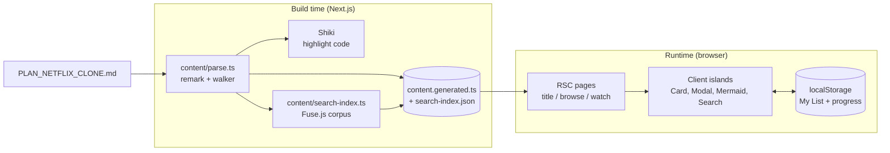
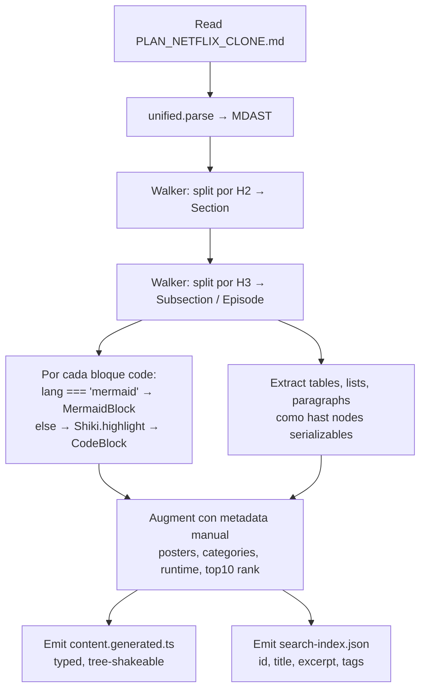
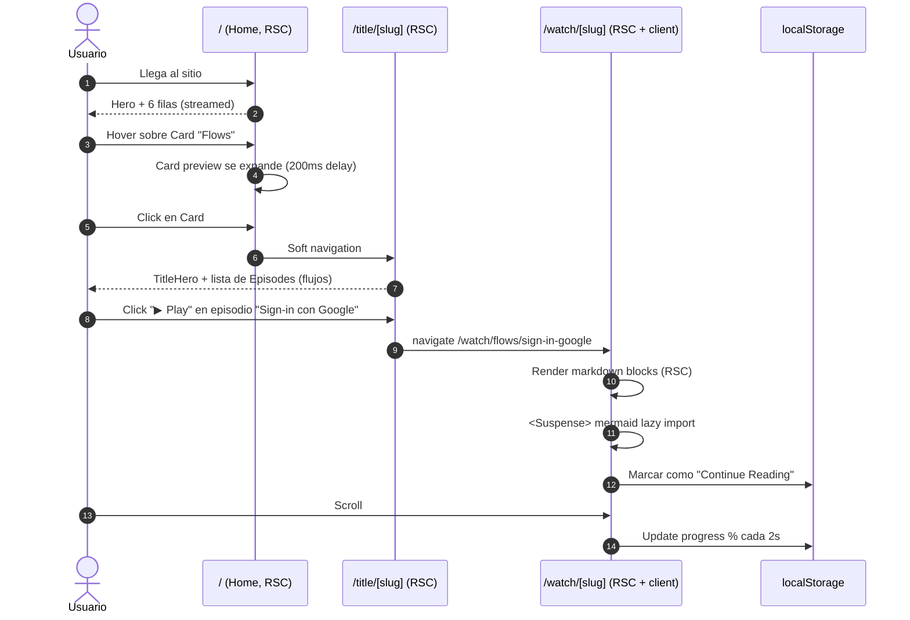

# Netflix Docs Viewer — Plan Maestro

> Aplicación Next.js 16 que **muestra el contenido de [PLAN_NETFLIX_CLONE.md](PLAN_NETFLIX_CLONE.md) con el look-and-feel de Netflix**: hero rotativo, filas horizontales con cards, hover preview, modal de detalle y "player" inmersivo para diagramas y flujos.
> Documento único con scope, mapeo de contenido, stack, arquitectura, rutas, componentes, pipeline de contenido, testing y secuencia de implementación.

---

## Tabla de Contenido

1. [Visión y Concepto](#1-visión-y-concepto)
2. [Mapeo Contenido → UI Netflix](#2-mapeo-contenido--ui-netflix)
3. [Stack Tecnológico](#3-stack-tecnológico)
4. [Arquitectura](#4-arquitectura)
5. [Pipeline de Contenido (Build-time)](#5-pipeline-de-contenido-build-time)
6. [Modelo de Datos (in-memory)](#6-modelo-de-datos-in-memory)
7. [Mapa de Rutas](#7-mapa-de-rutas)
8. [Flujos de Usuario](#8-flujos-de-usuario)
9. [Inventario de Componentes](#9-inventario-de-componentes)
10. [Sistema de Diseño](#10-sistema-de-diseño)
11. [Estrategia de Testing](#11-estrategia-de-testing)
12. [Performance, A11y y SEO](#12-performance-a11y-y-seo)
13. [Secuencia de Implementación](#13-secuencia-de-implementación)
14. [Riesgos y Decisiones Abiertas](#14-riesgos-y-decisiones-abiertas)

---

## 1. Visión y Concepto

**Producto.** Un sitio de documentación que **es** una experiencia Netflix. El usuario "navega el catálogo" del proyecto Netflix Clone: cada sección del plan es un "título", cada flujo es un "episodio", cada diagrama Mermaid es contenido reproducible en un player inmersivo.

**Por qué Netflix-style y no docs site convencional:**
- El contenido del plan ya está estructurado por secciones, subsecciones, flujos numerados y categorías → encaja naturalmente en filas/géneros.
- Los diagramas Mermaid se benefician de una vista "fullscreen player" con zoom/pan.
- Es un showcase de portfolio: la presentación del plan también demuestra dominio del producto que se está planeando.

**Principios rectores:**
- **Contenido como source of truth.** `PLAN_NETFLIX_CLONE.md` se parsea en build → estructura JSON. Editar el `.md` regenera la UI.
- **Server-first.** RSC para rendering del contenido. Cliente solo para interactividad (hover preview, modal, search, mermaid).
- **Estática por defecto.** Todas las páginas son `generateStaticParams` + `use cache`. Sin DB, sin auth, sin runtime backend.
- **Mermaid lazy + code-split.** El bundle de mermaid (~1MB) solo carga cuando hay un diagrama visible.
- **Sin features fuera de scope.** No replicamos auth, perfiles, billing, video real — solo la **capa visual y de navegación** de Netflix.

**Alcance excluido:** auth real, perfiles persistidos en server, pagos, reproducción de video real, recomendaciones ML, i18n (post-MVP).

---

## 2. Mapeo Contenido → UI Netflix

Cada sección del plan original se transforma en un patrón visual concreto:

| Plan §  | Contenido                          | Patrón Netflix                                    | Ruta                          |
|---------|------------------------------------|--------------------------------------------------|-------------------------------|
| §1      | Visión General                     | **Hero rotativo** principal (billboard)          | `/`                           |
| §2      | Key Features (17)                  | Row **"Top 10 Features"** (numerada estilo Top10)| `/` row                       |
| §3      | Stack Tecnológico                  | Row **"Powering the Platform"** (1 card / tech)  | `/browse/stack`               |
| §4      | Arquitectura                       | Title destacado con **diagrama jugable**         | `/title/architecture`         |
| §5      | Modelo de Datos                    | Title con **ER diagram en player**               | `/title/data-model`           |
| §6      | Mapa de Rutas (App Router)         | Title con **tree diagram** + tabla rendering     | `/title/routes`               |
| §7      | Flujos Principales (6 flujos)      | **"Serie" con 6 episodios** (cada flujo = ep.)   | `/title/flows` + `/watch/...` |
| §8      | Aspectos Transversales (5 subs)    | Row de subsecciones                              | `/browse/cross-cutting`       |
| §9      | Inventario de Componentes          | **Página de género** con filtros (S/C, área)     | `/browse/components`          |
| §10     | Estrategia de Testing              | Title con **pirámide animada** como hero         | `/title/testing`              |
| §11     | Seguridad (20 amenazas)            | **Género "Security"** con cards amenaza/mitig.  | `/browse/security`            |
| §12     | Secuencia de Implementación        | **"Schedule" / Timeline horizontal**             | `/browse/roadmap`             |
| §13     | Riesgos y Preguntas                | Row **"Coming Soon"**                            | `/` row                       |

**Patrones recurrentes:**
- **Card hover preview**: muestra los primeros ~120 chars de la sección + tags.
- **Modal de detalle**: muestra abstract + tabla de "episodios" (subsecciones) + botón "▶ Play".
- **Click en Play** → `/watch/[slug]`: vista inmersiva fullscreen con el contenido completo (markdown rendered, mermaid centered, code blocks con syntax highlight, scroll vertical con progress bar fija arriba).
- **Tabla de contenidos lateral**: aparece en hover dentro del player, como el menú "Episodes" de Netflix.

---

## 3. Stack Tecnológico

### 3.1 Aplicación

| Concern         | Elección                                        | Razón                                                   |
|-----------------|-------------------------------------------------|---------------------------------------------------------|
| Framework       | **Next.js 16** App Router + Cache Components    | Mismo stack del plan original; SSG agresivo.            |
| Lenguaje        | **TypeScript estricto**                         | `strict: true`, `noUncheckedIndexedAccess: true`.       |
| Styling         | **Tailwind CSS 4** + CSS variables              | Tokens del design system Netflix.                       |
| UI primitives   | **Radix UI** + **shadcn/ui** (Dialog, Tooltip)  | Modal con focus trap accesible.                         |
| Animaciones     | **Framer Motion** (solo donde se necesita)      | Hover scale, layout transitions.                        |
| Iconos          | **lucide-react**                                | Tree-shakeable.                                         |
| Hosting         | **Vercel**                                      | SSG + edge.                                             |

### 3.2 Contenido y rendering

| Concern              | Elección                                     | Razón                                                |
|----------------------|----------------------------------------------|------------------------------------------------------|
| Markdown parsing     | **unified + remark + remark-gfm**            | AST manipulable.                                     |
| MDX (post-MVP)       | **@next/mdx**                                | Permite componentes embebidos en secciones futuras.  |
| Syntax highlighting  | **Shiki** (server-side, tema `github-dark`)  | Sin runtime cost, output HTML estático.              |
| Diagramas            | **mermaid** (dynamic import, client only)    | Pesado → lazy + Suspense.                            |
| Search               | **Fuse.js** (client) sobre índice pre-built  | Corpus pequeño (~200KB JSON), sin servidor.          |
| Persistencia local   | **localStorage** + Zustand `persist`          | My List, Continue Reading, último visitado.          |

### 3.3 Observabilidad y calidad

| Concern         | Elección                  |
|-----------------|---------------------------|
| Analytics       | Vercel Analytics + Web Vitals |
| Error tracking  | Sentry (free tier)        |
| Bundle budget   | size-limit en CI          |
| A11y            | axe-core en E2E           |

### 3.4 Variables de entorno

```bash
# Mínimas para MVP
NEXT_PUBLIC_SITE_URL=https://docs-viewer.example.com

# Opcional
SENTRY_DSN=
NEXT_PUBLIC_VERCEL_ANALYTICS_ID=
```

> **No hay secretos de auth/DB/pagos.** El sitio es 100% estático.

---

## 4. Arquitectura



**Runtimes:**
- Todas las rutas en **Edge runtime** (no hay DB).
- Imágenes: `next/image` con remote patterns vacío (todo es local o SVG generado).

**Cache strategy:**
- `force-cache` por defecto en todas las rutas.
- `revalidateTag('content')` solo se usaría en build (no hay actualizaciones en runtime).
- Sin `dynamic = 'force-dynamic'` en ninguna ruta.

---

## 5. Pipeline de Contenido (Build-time)

El núcleo del proyecto. Convierte un `.md` monolítico en datos estructurados consumibles por RSC.

### 5.1 Pasos



### 5.2 Ubicación

```
content/
├── parse.ts                  # script CLI: tsx content/parse.ts
├── augment.ts                # metadata hand-crafted por sección
├── shiki.ts                  # singleton highlighter
├── generated/
│   ├── content.ts            # output del parser (gitignored o committed)
│   └── search-index.json
└── types.ts                  # Section, Episode, Block, etc.
```

### 5.3 Trigger

- `npm run content:build` ejecuta `tsx content/parse.ts`.
- En `package.json`: `"prebuild": "npm run content:build"`.
- Dev: `tsx watch content/parse.ts` corre en paralelo a `next dev`.

---

## 6. Modelo de Datos (in-memory)

```ts
// content/types.ts

export type SectionId =
  | 'overview' | 'features' | 'stack' | 'architecture' | 'data-model'
  | 'routes' | 'flows' | 'cross-cutting' | 'components' | 'testing'
  | 'security' | 'roadmap' | 'risks';

export type Category =
  | 'product' | 'architecture' | 'flows' | 'security'
  | 'testing' | 'stack' | 'roadmap';

export interface Section {
  id: SectionId;
  slug: string;                // url-safe
  title: string;
  category: Category;
  hero: {
    tagline: string;           // 1 frase
    poster: PosterSpec;        // gradient + icon, generado
    backdrop: PosterSpec;      // 16:9 más ancho
  };
  meta: {
    runtime: number;           // minutos estimados de lectura
    rank?: number;             // 1..10 si entra a "Top 10"
    rating?: 'P0' | 'P1' | 'P2'; // de la columna Prioridad del plan
    badges: string[];          // ej: ['New', 'Featured', 'P0']
  };
  excerpt: string;             // ~120 chars para hover preview
  episodes: Episode[];         // subsecciones
}

export interface Episode {
  id: string;                  // section.id + '/' + slug
  number: number;              // orden dentro de la sección
  title: string;
  runtime: number;
  blocks: Block[];             // contenido renderable
}

export type Block =
  | { kind: 'prose'; html: string }              // párrafos, listas, headings inline
  | { kind: 'code'; lang: string; html: string } // ya highlighted por Shiki
  | { kind: 'mermaid'; source: string; id: string }
  | { kind: 'table'; html: string }
  | { kind: 'callout'; variant: 'info' | 'warn'; html: string };

export interface PosterSpec {
  gradient: [string, string];  // dos colores
  icon: string;                // nombre lucide-react
  pattern?: 'dots' | 'grid' | 'noise';
}

export interface SearchDoc {
  id: string;                  // section o episode id
  sectionId: SectionId;
  title: string;
  category: Category;
  excerpt: string;
  text: string;                // contenido plano para búsqueda
}
```

**Posters generados, no imágenes.** Cada sección tiene gradient + icon + pattern sutil → componente `<PosterCanvas>` los renderiza como SVG. Resultado: cero imágenes de stock, look consistente, build súper liviano.

---

## 7. Mapa de Rutas

```
app/
├── layout.tsx                          # html shell, fonts, dark mode default
├── page.tsx                            # HOME: hero + filas (RSC, static)
├── (browse)/
│   ├── layout.tsx                      # TopNav transparente
│   ├── browse/
│   │   ├── stack/page.tsx              # row tech grid
│   │   ├── security/page.tsx           # género security
│   │   ├── components/page.tsx         # género componentes (filtros C/S)
│   │   ├── cross-cutting/page.tsx
│   │   └── roadmap/page.tsx            # timeline horizontal
│   ├── title/[slug]/page.tsx           # detalle de sección + episodes list
│   ├── search/page.tsx                 # results (?q=)
│   └── my-list/page.tsx                # lectura desde localStorage (CSR)
├── watch/
│   └── [slug]/page.tsx                 # PLAYER: contenido inmersivo
├── api/
│   └── og/[slug]/route.ts              # OG image dinámica por sección
└── not-found.tsx
```

### Estrategia de rendering

| Ruta                        | Estrategia                              | Cliente requerido para           |
|-----------------------------|-----------------------------------------|----------------------------------|
| `/`                         | SSG, `use cache`                        | Hero autoplay, Card hover        |
| `/browse/[area]`            | SSG, `generateStaticParams`             | Card hover, filtros              |
| `/title/[slug]`             | SSG, `generateStaticParams` + metadata  | Modal en backdrop                |
| `/watch/[slug]`             | SSG                                     | Mermaid render, scroll progress  |
| `/search`                   | RSC con `useSearchParams` (Suspense)    | Fuse.js index (lazy)             |
| `/my-list`                  | CSR (lee localStorage)                  | Todo                             |
| `/api/og/[slug]`            | Edge route                              | —                                |

---

## 8. Flujos de Usuario

### 8.1 Home → Detalle → Watch (camino feliz)



### 8.2 Búsqueda

```mermaid
flowchart LR
    A[Type en SearchBar] --> B{debounce 200ms}
    B --> C[Lazy-load search-index.json<br/>solo primera vez]
    C --> D[Fuse.search query]
    D --> E[router.replace ?q=...]
    E --> F[/search/page.tsx<br/>renderiza grid resultados]
    F --> G{Click}
    G --> H[/title/slug or /watch/slug]
```

### 8.3 My List (sin auth)

- Card tiene botón **+** que invoca `useMyList().toggle(sectionId)`.
- Hook persiste en `localStorage['nf-docs:my-list']` vía Zustand `persist`.
- `/my-list` es CSR puro: lee del store y renderiza el mismo `<Card>` reutilizado.
- **No hay sync entre dispositivos** — es feature simbólica del clone.

### 8.4 Player inmersivo (`/watch/[slug]`)

```mermaid
flowchart TD
    A[Mount /watch/[slug]] --> B[RSC entrega blocks pre-highlighted]
    B --> C{Block kind?}
    C -- prose/code/table --> D[Render directo HTML]
    C -- mermaid --> E[Suspense → dynamic import mermaid]
    E --> F[mermaid.render → SVG]
    F --> G[Wrap en <DiagramViewer><br/>zoom + pan + fullscreen]
    A --> H[ScrollProgressBar fixed top]
    A --> I[EpisodeMenu drawer<br/>activado en hover izq]
    A --> J[Keyboard shortcuts:<br/>F=fullscreen mermaid<br/>J/L=ep prev/next<br/>Esc=back to title]
```

---

## 9. Inventario de Componentes

> (S) = Server Component · (C) = Client Component

### 9.1 Layout
- `TopNav` (C) — transparente sobre hero, sólida al scroll, logo "NF DOCS"
- `Logo` (S)
- `MobileNav` (C)
- `Footer` (S) — links a PLAN_NETFLIX_CLONE.md y nextjs.md en GitHub

### 9.2 Browse / Home
- `BillboardHero` (C) — featured section, autoplay rotation cada 8s, controles "▶ Play" / "ⓘ More info"
- `Row` (S, async streaming) — título + scroll horizontal
- `RowSkeleton` (S)
- `Top10Row` (S) — variante con número grande detrás de la card (SVG)
- `Card` (C) — hover scale 1.5x con preview animado
- `CardPreview` (C) — overlay con título, badges, tagline, botones +, ▶
- `PosterCanvas` (S) — SVG generado a partir de `PosterSpec`

### 9.3 Title detail
- `TitleHero` (S) — backdrop + título + meta + acciones
- `EpisodeList` (S) + `EpisodeRow` (C, focus + click handler)
- `MoreLikeThis` (S) — secciones de la misma `category`
- `DetailModal` (C) — abre desde Card, focus trap, ESC cierra

### 9.4 Player (`/watch/[slug]`)
- `PlayerShell` (C)
- `ScrollProgressBar` (C)
- `EpisodeDrawer` (C)
- `KeyboardShortcuts` (C, headless)
- `DiagramViewer` (C) — wrapper de mermaid con zoom/pan/fullscreen (svg-pan-zoom)
- `MermaidDiagram` (C, dynamic) — `import('mermaid')` solo cuando visible
- `CodeBlock` (S) — ya highlighted por Shiki, botón Copy es C
- `CopyButton` (C)

### 9.5 Search
- `SearchBar` (C) — modal estilo Netflix (icono lupa → input expand)
- `SearchResultsGrid` (S, Suspense)

### 9.6 My List
- `MyListGrid` (C, lee Zustand)
- `AddToListButton` (C)

### 9.7 System
- `app/error.tsx` (C), `app/not-found.tsx` (S), `loading.tsx` por segmento

---

## 10. Sistema de Diseño

### 10.1 Tokens (Tailwind v4 `@theme`)

```css
@theme {
  --color-bg: #141414;
  --color-bg-elevated: #1f1f1f;
  --color-fg: #ffffff;
  --color-fg-muted: #b3b3b3;
  --color-brand: #e50914;       /* Netflix red */
  --color-brand-hover: #f40612;
  --color-success: #46d369;
  --color-border: #2a2a2a;

  --radius-card: 4px;           /* Netflix usa cards casi cuadradas */
  --shadow-card-hover: 0 25px 50px -12px rgb(0 0 0 / 0.8);

  --font-sans: 'Inter', 'Netflix Sans', system-ui, sans-serif;

  --easing-netflix: cubic-bezier(0.4, 0, 0.2, 1);
  --duration-card: 300ms;
}
```

### 10.2 Componentes clave — specs visuales

**Card (default 240×135, ratio 16:9):**
- Border-radius `--radius-card`.
- Hover: `scale-[1.5]`, `z-50`, transition `300ms var(--easing-netflix)` con delay `400ms` (anti-flicker).
- Preview overlay aparece a los `400ms` del hover (igual que Netflix real).
- En touch devices: hover desactivado, click abre modal directo.

**Top 10 row:**
- Cada card precedida por un número SVG gigante (font-weight 900, stroke white, fill bg) que se ve "detrás" de la card por z-index.

**Hero billboard:**
- Backdrop full-bleed con gradient mask `linear-gradient(to right, bg 0%, bg 30%, transparent 70%)` + `linear-gradient(to top, bg 0%, transparent 50%)` para legibilidad.
- Título: `text-6xl font-black`.
- Acciones: botón blanco `▶ Play` + botón gris translúcido `ⓘ Más información`.

**Player:**
- Fondo `--color-bg` puro.
- Contenido en columna centrada `max-w-prose` para texto, `max-w-6xl` para diagramas.
- Diagrama Mermaid centrado, controles flotantes abajo derecha (zoom in/out/reset/fullscreen).

### 10.3 Motion

- Respetar `prefers-reduced-motion`: desactiva autoplay del hero y del card preview.
- Layout transitions con Framer Motion **solo** en el modal y el player drawer.

---

## 11. Estrategia de Testing

### 11.1 Pirámide

```
                 /\
                /E2\         ~6–10   Playwright (flujos críticos)
               /----\
              /Integ.\       ~20     Vitest (parser + search)
             /--------\
            /Component \     ~40–60  Vitest + RTL
           /------------\
          /     Unit     \   ~80+    Vitest puro
         /----------------\
```

### 11.2 Tooling

| Capa             | Herramienta                                  | Para qué                                      |
|------------------|----------------------------------------------|-----------------------------------------------|
| Unit             | **Vitest**                                   | Parser MD, augment, search index builder.     |
| Component        | **Vitest + RTL + jest-dom**                  | Card hover/touch, Modal focus trap, SearchBar.|
| RSC              | **Vitest** (renderToString)                  | Home page rows, Title page metadata.          |
| Integration      | **Vitest** (sin DB — es estático)            | Pipeline parse → render end-to-end.           |
| E2E              | **Playwright** (Chromium + WebKit)           | Flujos críticos.                              |
| Visual           | **Playwright `toHaveScreenshot`**            | Hero, Card hover state, Player.               |
| A11y             | **@axe-core/playwright**                     | En cada test E2E.                             |
| Performance      | **Lighthouse CI**                            | LCP, CLS, TBT en `/`.                         |
| Bundle           | **size-limit**                               | First-load JS ≤ 130KB gz.                     |

### 11.3 Tests prioritarios

**Unit:**
- `content/parse.ts`: split por H2/H3 produce N secciones esperadas; bloques mermaid se detectan; tablas serializadas correctamente.
- `content/augment.ts`: cada `SectionId` tiene metadata; runtimes ≥ 1 min.
- `search/index.ts`: corpus contiene texto plano sin HTML; búsqueda exacta encuentra el título.

**Component:**
- `<Card>`: hover dispara preview con delay 400ms; touch device no muestra preview; keyboard `Enter` navega.
- `<DetailModal>`: focus trap; ESC cierra; backdrop click cierra; restaura focus al trigger.
- `<SearchBar>`: debounce 200ms; vacío limpia `?q`.
- `<MermaidDiagram>`: muestra fallback mientras carga; renderiza SVG; error de sintaxis muestra mensaje.
- `<DiagramViewer>`: zoom in/out; reset; F entra a fullscreen.

**E2E (críticos):**
1. Home carga y muestra hero + ≥ 5 filas.
2. Hover en card muestra preview a los ~400ms.
3. Click en card → modal con "▶ Play" → click → `/watch/[slug]`.
4. Player muestra primer diagrama Mermaid renderizado correctamente.
5. Search "OAuth" devuelve sección "Flows" como primer resultado.
6. Add to My List → reload → sigue en `/my-list`.
7. Keyboard: Tab por home, Enter en card, ESC en modal.
8. A11y: axe sin violaciones `serious`/`critical` en `/`, `/title/flows`, `/watch/flows-sign-in`.

---

## 12. Performance, A11y y SEO

### 12.1 Budgets

| Métrica            | Target                  |
|--------------------|-------------------------|
| LCP (`/`)          | < 2.0s (4G simulado)    |
| CLS                | < 0.05                  |
| TBT                | < 150ms                 |
| First-load JS      | ≤ 130KB gzip            |
| Lighthouse Perf    | ≥ 95                    |
| A11y               | 0 violaciones serias    |

### 12.2 Tácticas

- Mermaid en `dynamic(() => import('mermaid'), { ssr: false })` con Suspense.
- Shiki ejecutado en build, no en runtime.
- Posters como SVG inline (no imágenes externas).
- Fuente con `next/font` y `display: swap`.
- `next/link` con `prefetch={true}` para cards above-the-fold.
- `loading="lazy"` para cards below-the-fold (CSS `content-visibility: auto`).

### 12.3 SEO

- `generateMetadata` por título: `<title>`, `<meta description>` desde `excerpt`, `og:image` dinámico desde `/api/og/[slug]`.
- `sitemap.ts` con todas las secciones y episodes.
- `robots.ts` permite todo (es público).
- JSON-LD `TVSeries` + `TVEpisode` para `/title` y `/watch` (homenaje al concepto).

### 12.4 A11y

- Card es `<a>` con `aria-label="Open {title}"`.
- Modal: `role="dialog"`, `aria-modal="true"`, `aria-labelledby` al título.
- Player: shortcuts documentados en panel `?` (igual que Netflix).
- Contraste: texto sobre `--color-bg` ≥ 7:1 (AAA donde es texto pequeño).
- `prefers-reduced-motion`: desactiva hero rotation y card preview animation.

---

## 13. Secuencia de Implementación

Cada fase es shippable.

| Fase | Días | Entregable                                                                                      |
|------|------|-------------------------------------------------------------------------------------------------|
| **0. Foundation**          | 1   | `create-next-app --ts --tailwind --app --src-dir`, ESLint, Prettier, Husky, Vitest, Playwright. |
| **1. Content pipeline**    | 2–3 | `content/parse.ts`, `augment.ts`, Shiki, types, `content.generated.ts` checked-in.              |
| **2. Design system**       | 4   | Tailwind tokens, `<PosterCanvas>`, `<Card>`, `<Row>`, fonts, dark default.                      |
| **3. Home + Browse**       | 5–6 | `/` con hero + 6 rows; `/browse/[area]` con `generateStaticParams`.                             |
| **4. Title + Modal**       | 7   | `/title/[slug]`, `<DetailModal>`, episodes list.                                                |
| **5. Player + Mermaid**    | 8–9 | `/watch/[slug]`, `<DiagramViewer>` con zoom/pan, syntax-highlighted code blocks.                |
| **6. Search**              | 10  | `<SearchBar>`, `/search`, lazy Fuse.js index.                                                   |
| **7. My List + persistence** | 11 | Zustand persist, `/my-list`, AddToListButton.                                                  |
| **8. A11y + Performance**  | 12  | axe pass, Lighthouse ≥ 95, bundle gate.                                                         |
| **9. Testing hardening**   | 13–14 | Unit ≥ 80% en `content/`, E2E críticos verdes, visual snapshots base.                         |
| **10. Polish + Deploy**    | 15  | OG dinámico, sitemap/robots, Vercel deploy, dominio, README.                                    |
| **Stretch (post-MVP)**     | —   | i18n EN/ES, modo "trailer" (autoplay scroll del player), share deep-links con timestamp.        |

---

## 14. Riesgos y Decisiones Abiertas

### 14.1 Riesgos

| Riesgo                                              | Mitigación                                                  |
|-----------------------------------------------------|-------------------------------------------------------------|
| Bundle de mermaid empuja first-load JS              | Lazy + `ssr: false` + Suspense; nunca importar en home.     |
| Parser frágil ante cambios en `PLAN_NETFLIX_CLONE.md` | Tests del parser por sección; CI falla si falta una `SectionId`. |
| Cards con hover preview agresivo en mobile          | Detección `hover: hover` en CSS; en touch, click → modal.   |
| Visual regression flaky por fuentes                 | `next/font` self-hosted, fixedWidth en snapshots.           |
| SEO de un sitio "fake Netflix" puede confundir bots | Robots permite todo; metadata clara `Netflix Clone — Plan Docs`. |

### 14.2 Decisiones abiertas

1. **¿Una "season" por categoría o por sección?** Plan actual: una "season" = una sección, episodes = subsecciones. Alternativa: una "season" = una categoría, episodes = secciones.
2. **¿OG images con `@vercel/og` o pre-generadas?** Pre-generadas en build es más simple y barato.
3. **¿Trailer autoplay mostrando un GIF del diagrama?** Cool pero costoso; dejar para post-MVP.
4. **¿Soportar deep-link `/watch/flows#sign-in?t=120`?** El "t" no aplica (no hay video real), pero podríamos usarlo como scroll-anchor.
5. **¿Servir nextjs.md también?** Podría ser un "Documentary" extra ("The Making of Next.js Clone").

---

**Confirmado el plan, arrancamos en Fase 0.**
