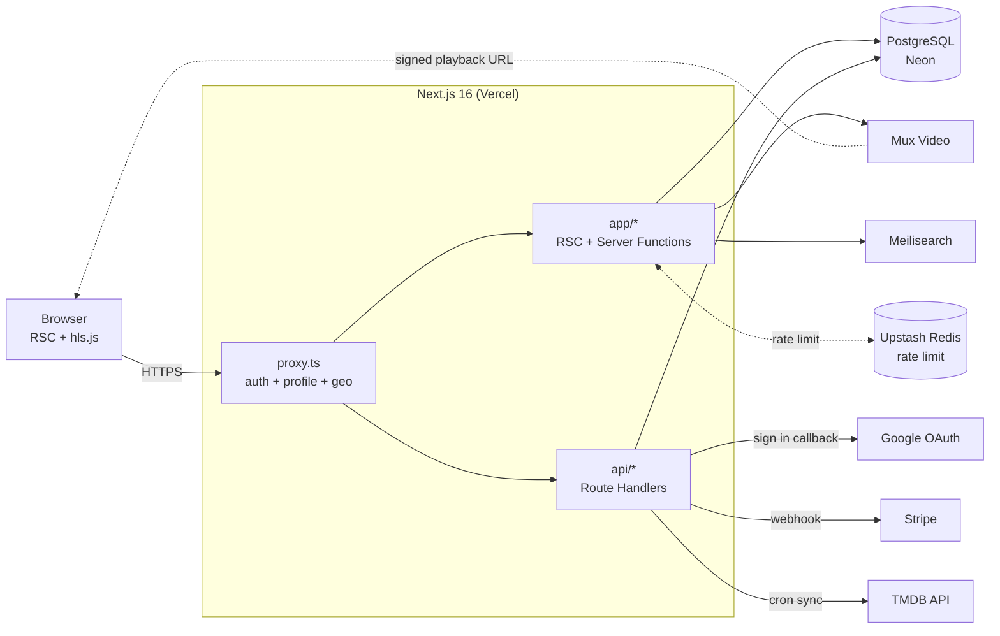
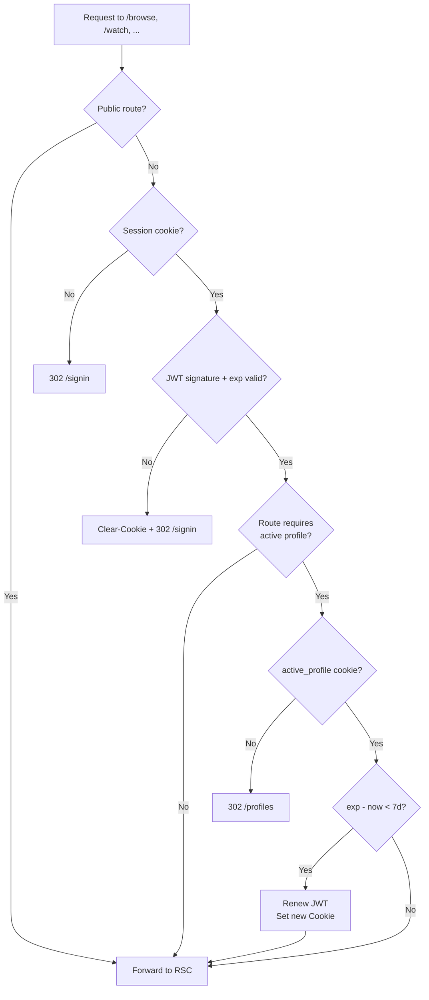
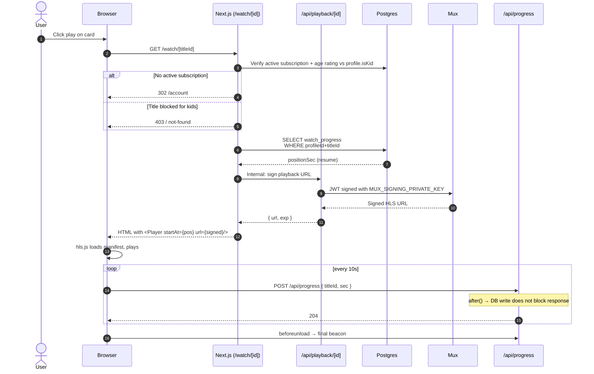
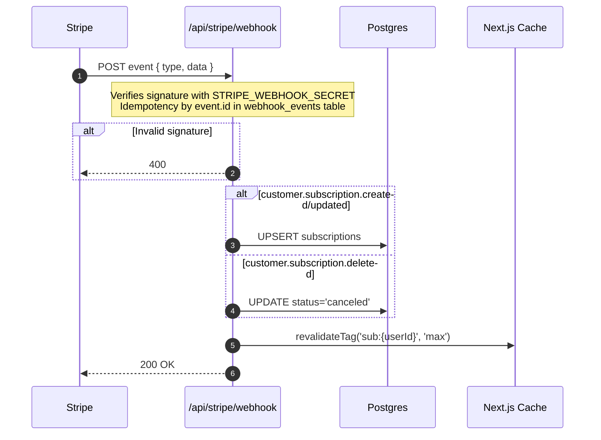

# Netflix Clone — Master Plan

> Single document covering **product scope, tech stack, architecture, main flows (with Mermaid diagrams), security aspects, testing strategy, and implementation sequence**.
> Technical reference for Next.js 16 (App Router, Cache Components): [nextjs.md](nextjs.md).

---

## Table of Contents

1. [Overview](#1-overview)
2. [Key Features](#2-key-features)
3. [Tech Stack and Services](#3-tech-stack-and-services)
4. [Architecture](#4-architecture)
5. [Data Model](#5-data-model)
6. [Route Map (App Router)](#6-route-map-app-router)
7. [Main Flows](#7-main-flows) ← _with Mermaid diagrams_
8. [Cross-Cutting Concerns](#8-cross-cutting-concerns)
9. [Component Inventory](#9-component-inventory)
10. [Testing Strategy](#10-testing-strategy) ← _unit, component, integration, E2E, security_
11. [Security](#11-security)
12. [Implementation Sequence](#12-implementation-sequence)
13. [Risks and Open Questions](#13-risks-and-open-questions)

---

## 1. Overview

Build a functional Netflix clone with the features that define the product: authentication, profiles, catalog browsing, detail page, video player, search, lists, recommendations, and subscriptions.

**Guiding principles:**

- **Server-first**: most work happens in React Server Components; the client only receives interactive components.
- **Aggressive caching, precise invalidation**: catalog cached with `use cache` + `cacheTag`; mutations invalidate specific tags.
- **Security by default**: `httpOnly` + `secure` cookies, server-side validation, strict CSP, OAuth with PKCE.
- **Testable at every layer**: unit, component, integration, and E2E.

**Excluded scope (clone, not real Netflix):** DRM (Widevine/PlayReady/FairPlay), proprietary multi-region CDN, production-grade ML recommendations, offline downloads, native apps.

---

## 2. Key Features

| #   | Feature                                           | Priority | Description                                                          |
| --- | ------------------------------------------------- | -------- | -------------------------------------------------------------------- |
| 1   | **Authentication with Google (OAuth 2.0 + PKCE)** | P0       | One-click sign in/up. Session via JWT in `httpOnly` cookie.          |
| 2   | **Multiple profiles per account**                 | P0       | Up to 5 profiles. Kids flag. Optional PIN.                           |
| 3   | **Browse / Home**                                 | P0       | Hero + rows (Trending, Continue Watching, New Releases, Genre rows). |
| 4   | **Detail page**                                   | P0       | Synopsis, cast, trailer, episodes (TV), "More Like This".            |
| 5   | **Video Player**                                  | P0       | Adaptive HLS, play/pause, seek, subtitles, quality, resume.          |
| 6   | **Search**                                        | P0       | Type-ahead by title, genre, actor.                                   |
| 7   | **My List**                                       | P0       | Watchlist per profile.                                               |
| 8   | **Continue Watching**                             | P0       | Resume points per profile/episode.                                   |
| 9   | **Genre pages**                                   | P1       | `/genre/[slug]`.                                                     |
| 10  | **Ratings** (👍/👎/❤️)                            | P1       | Feeds recommendations.                                               |
| 11  | **Subscriptions (Stripe)**                        | P1       | Basic / Standard / Premium.                                          |
| 12  | **Account settings**                              | P1       | Language, devices, billing.                                          |
| 13  | **Kids mode + parental controls**                 | P1       | PIN, age rating filter.                                              |
| 14  | **"Because you watched" recommendations**         | P2       | Content-based first, collaborative later.                            |
| 15  | **Trailer autoplay on hover**                     | P2       | Preview on card hover.                                               |
| 16  | **Notifications**                                 | P2       | New episodes.                                                        |
| 17  | **Offline downloads**                             | Excluded | Out of web scope.                                                    |

---

## 3. Tech Stack and Services

### 3.1 Application layer

| Concern       | Choice                                        | Reason                                                          |
| ------------- | --------------------------------------------- | --------------------------------------------------------------- |
| Framework     | **Next.js 16** (App Router, Cache Components) | RSC + streaming + Server Functions ([nextjs.md §6](nextjs.md)). |
| Language      | **Strict TypeScript**                         | Type safety server+client.                                      |
| Styling       | **Tailwind CSS + CSS variables**              | No runtime cost.                                                |
| UI primitives | **Radix UI + shadcn/ui**                      | Accessible, headless, easy dark mode.                           |
| Forms         | **React Hook Form + Zod**                     | Zod schemas reused in Server Functions.                         |
| Client state  | **Zustand** (player + UI shell only)          | Rest of state in RSC / URL.                                     |
| Hosting       | **Vercel**                                    | Native cache + edge proxy.                                      |

### 3.2 Data and identity

| Concern  | Choice                                         | Reason                                  |
| -------- | ---------------------------------------------- | --------------------------------------- |
| Database | **PostgreSQL (Neon)**                          | Serverless, branchable.                 |
| ORM      | **Drizzle ORM**                                | Edge-friendly, SQL-first.               |
| Auth     | **Auth.js v5 (NextAuth)** with Google provider | Handles PKCE/state/nonce automatically. |
| Session  | **JWT in httpOnly cookie**                     | No DB lookup per request.               |
| Adapter  | `@auth/drizzle-adapter`                        | `users`, `accounts` tables.             |

### 3.3 Catalog, video, search, payments

| Concern        | Choice                                               |
| -------------- | ---------------------------------------------------- |
| Title metadata | **TMDB API** (nightly sync to Postgres)              |
| Video hosting  | **Mux** (HLS + signed URLs + thumbnails)             |
| Player         | `hls.js` + custom shell                              |
| Search         | **Meilisearch Cloud** (fallback Postgres `tsvector`) |
| Payments       | **Stripe** (Checkout + Portal + Webhooks)            |
| Images         | `next/image` + `image.tmdb.org`                      |

### 3.4 Cross-cutting infrastructure

| Concern         | Choice                                         |
| --------------- | ---------------------------------------------- |
| Cron            | Vercel Cron → Route Handlers                   |
| Background jobs | Next.js `after()` ([nextjs.md §16](nextjs.md)) |
| Rate limiting   | Upstash Redis                                  |
| Logs            | Axiom                                          |
| Analytics       | PostHog                                        |
| Error tracking  | Sentry                                         |
| Secrets         | Vercel env vars                                |

### 3.5 Environment variables

```bash
# Core
AUTH_SECRET=                  # openssl rand -base64 32
AUTH_URL=https://app.com
DATABASE_URL=                 # Neon
# Google OAuth
GOOGLE_CLIENT_ID=
GOOGLE_CLIENT_SECRET=
# Mux
MUX_TOKEN_ID=
MUX_TOKEN_SECRET=
MUX_SIGNING_KEY_ID=
MUX_SIGNING_PRIVATE_KEY=
# Stripe
STRIPE_SECRET_KEY=
STRIPE_WEBHOOK_SECRET=
NEXT_PUBLIC_STRIPE_PUBLISHABLE_KEY=
# TMDB
TMDB_API_KEY=
TMDB_READ_TOKEN=
# Search
MEILISEARCH_HOST=
MEILISEARCH_API_KEY=
# Observability
SENTRY_DSN=
NEXT_PUBLIC_POSTHOG_KEY=
AXIOM_TOKEN=
# Rate limit
UPSTASH_REDIS_REST_URL=
UPSTASH_REDIS_REST_TOKEN=
```

---

## 4. Architecture



**Runtimes:**

- `proxy.ts` and static routes → **Edge runtime**.
- Routes touching DB/Mux → **Node runtime** (Postgres driver).

---

## 5. Data Model

```ts
// db/schema/index.ts (Drizzle)

// --- Auth (standard Auth.js) ---
users (
  id            uuid PK,
  email         text UNIQUE NOT NULL,
  emailVerified timestamptz,
  name          text,
  image         text,
  createdAt     timestamptz default now()
)

accounts (
  userId             uuid FK → users.id ON DELETE CASCADE,
  type               text,        -- 'oauth'
  provider           text,        -- 'google'
  providerAccountId  text,        -- sub from ID token
  id_token           text,
  access_token       text,
  refresh_token      text,
  expires_at         bigint,
  scope              text,
  PRIMARY KEY (provider, providerAccountId)
)
CREATE INDEX ON accounts(userId);

// --- Product ---
profiles (
  id        uuid PK,
  userId    uuid FK → users.id ON DELETE CASCADE,
  name      text,
  avatar    text,
  isKid     boolean default false,
  pinHash   text             -- bcrypt, nullable
)
CREATE INDEX ON profiles(userId);

subscriptions (
  id                   uuid PK,
  userId               uuid FK → users.id,
  stripeCustomerId     text UNIQUE,
  stripeSubscriptionId text UNIQUE,
  plan                 text,    -- 'basic' | 'standard' | 'premium'
  status               text,    -- 'active' | 'past_due' | 'canceled' | ...
  currentPeriodEnd     timestamptz
)

// --- Catalog ---
titles (
  id            uuid PK,
  tmdbId        bigint UNIQUE,
  type          text,           -- 'movie' | 'tv'
  title         text,
  slug          text UNIQUE,
  overview      text,
  posterPath    text,
  backdropPath  text,
  releaseDate   date,
  runtime       int,
  ageRating     text,           -- 'G' | 'PG' | 'PG-13' | 'R' | 'TV-MA' ...
  playbackId    text,           -- Mux
  searchTerms   tsvector
)
CREATE INDEX ON titles(slug);
CREATE INDEX ON titles USING gin(searchTerms);

genres        (id, name, slug)
title_genres  (titleId, genreId)  -- M:N
episodes      (id, titleId, season, number, name, overview, runtime, playbackId)

// --- Per-profile interaction ---
watchlist (
  profileId  uuid FK → profiles.id ON DELETE CASCADE,
  titleId    uuid FK → titles.id,
  addedAt    timestamptz default now(),
  PRIMARY KEY (profileId, titleId)
)

watch_progress (
  profileId    uuid FK → profiles.id,
  titleId      uuid FK → titles.id,
  episodeId    uuid NULL,
  positionSec  int,
  durationSec  int,
  updatedAt    timestamptz default now(),
  PRIMARY KEY (profileId, titleId, episodeId)
)
CREATE INDEX ON watch_progress(profileId, updatedAt DESC);

ratings (
  profileId  uuid,
  titleId    uuid,
  value      text,        -- 'up' | 'down' | 'love'
  createdAt  timestamptz default now(),
  PRIMARY KEY (profileId, titleId)
)
```

---

## 6. Route Map (App Router)

```
app/
├── layout.tsx                       # html shell, fonts (S)
├── page.tsx                         # marketing landing (static)
├── (auth)/
│   ├── layout.tsx                   # logo-only chrome
│   ├── signin/page.tsx              # "Continue with Google" button
│   └── signup/page.tsx
├── (app)/                           # auth + profile required
│   ├── layout.tsx                   # TopNav + ProfileMenu
│   ├── profiles/
│   │   ├── page.tsx                 # "Who's watching?"
│   │   ├── manage/page.tsx
│   │   └── actions.ts               # 'use server'
│   ├── browse/
│   │   ├── page.tsx                 # home (use cache + cacheTag)
│   │   ├── tv/page.tsx
│   │   ├── movies/page.tsx
│   │   ├── new/page.tsx
│   │   └── my-list/page.tsx         # NOT cached
│   ├── genre/[slug]/page.tsx        # generateStaticParams
│   ├── search/page.tsx
│   ├── title/[id]/page.tsx          # generateMetadata
│   ├── watch/[id]/page.tsx          # signed Mux URL + after()
│   └── account/
│       ├── page.tsx
│       └── devices/page.tsx
├── api/
│   ├── auth/[...nextauth]/route.ts  # Auth.js handlers
│   ├── stripe/webhook/route.ts
│   ├── sync/tmdb/route.ts           # cron
│   ├── search/route.ts
│   ├── progress/route.ts            # player heartbeat
│   └── playback/[id]/route.ts       # signed playback URL
└── proxy.ts                         # global guard
```

### Rendering strategy

| Route                 | Strategy                       | Cache                                        | Next.js primitive          |
| --------------------- | ------------------------------ | -------------------------------------------- | -------------------------- |
| `/`                   | Static                         | `force-cache`                                | `<Image priority>`         |
| `/signin`, `/signup`  | Dynamic                        | —                                            | Auth.js                    |
| `/profiles`           | Dynamic per user               | —                                            | `cookies()`                |
| `/browse`             | RSC streaming                  | `cacheTag('catalog')` + `cacheLife('hours')` | `use cache` + `<Suspense>` |
| `/browse/my-list`     | Dynamic per profile            | —                                            | `cookies()`                |
| `/genre/[slug]`       | `generateStaticParams` top 30  | `cacheTag('catalog')`                        | [nextjs.md §13](nextjs.md) |
| `/title/[id]`         | `generateStaticParams` top 500 | `cacheTag('title:{id}')`                     | `generateMetadata`         |
| `/search`             | Dynamic                        | —                                            | `useSearchParams`          |
| `/watch/[id]`         | Dynamic                        | —                                            | `after()` for logs         |
| `/account`            | Dynamic                        | `cacheTag('sub:{userId}')`                   | —                          |
| `/api/stripe/webhook` | Route Handler                  | —                                            | `revalidateTag`            |

---

## 7. Main Flows

### 7.1 Sign-in with Google (OAuth 2.0 + PKCE + OIDC)

```mermaid
sequenceDiagram
    autonumber
    actor U as User
    participant B as Browser
    participant N as Next.js (Auth.js)
    participant G as Google OAuth
    participant DB as PostgreSQL

    U->>B: Click "Continue with Google"
    B->>N: GET /api/auth/signin/google
    Note over N: Generates code_verifier, code_challenge=SHA256(verifier),<br/>state, nonce (32 random bytes each)
    N-->>B: Set-Cookie __Host-authjs.pkce.code_verifier,<br/>__Host-authjs.state, __Host-authjs.nonce<br/>(httpOnly, secure, sameSite=lax, 10 min)
    N-->>B: 302 accounts.google.com/o/oauth2/v2/auth?<br/>response_type=code&scope=openid email profile&<br/>code_challenge=...&code_challenge_method=S256&<br/>state=...&nonce=...
    B->>G: GET authorize endpoint
    G-->>U: Consent screen (first time)
    U->>G: Approve
    G-->>B: 302 /api/auth/callback/google?code=...&state=...
    B->>N: GET callback
    Note over N: 1. Validates state == cookie<br/>2. Reads code_verifier from cookie
    N->>G: POST /token (code + code_verifier + secret)
    G-->>N: { id_token, access_token }
    Note over N: 3. Verifies id_token signature vs Google JWK<br/>4. Validates iss, aud, exp, nonce<br/>5. Validates email_verified === true
    N->>DB: Upsert user + account
    alt New user
        N->>DB: INSERT users + INSERT profiles (default)
    else Email exists with another provider
        N-->>B: 302 /signin?error=OAuthAccountNotLinked
    end
    Note over N: Generates session JWT (HS256, AUTH_SECRET, 30d)
    N-->>B: Clear temp cookies; Set-Cookie __Secure-authjs.session-token<br/>302 /profiles
```

### 7.2 Session Validation on Every Request (proxy.ts)



### 7.3 Profile Selection

```mermaid
sequenceDiagram
    autonumber
    actor U as User
    participant B as Browser
    participant N as Next.js
    participant DB as Postgres

    U->>B: Arrives at /profiles already authenticated
    B->>N: GET /profiles
    N->>DB: SELECT profiles WHERE userId = jwt.sub
    DB-->>N: [profile1, profile2, ...]
    N-->>B: HTML profile grid
    U->>B: Click "Diego"
    B->>N: Server Function selectProfile(id)
    Note over N: Verifies profileId belongs to jwt.sub
    alt Profile with PIN
        N-->>B: Render PinDialog
        U->>B: Enter PIN
        B->>N: selectProfile(id, pin)
        N->>DB: bcrypt.compare(pin, profile.pinHash)
        alt Incorrect PIN
            N->>N: Rate limit check<br/>(5 failures / 15 min)
            N-->>B: 401 + message
        end
    end
    N-->>B: Set-Cookie active_profile=id; 302 /browse
```

### 7.4 Video Playback



### 7.5 Stripe Webhook (subscription signup/cancellation)



### 7.6 Sign Out

```mermaid
sequenceDiagram
    autonumber
    actor U as User
    participant B as Browser
    participant N as Next.js
    participant G as Google (optional)

    U->>B: Click "Sign out"
    B->>N: POST /api/auth/signout
    opt Remote revocation
        N->>G: POST /revoke?token=access_token
    end
    N-->>B: Set-Cookie session-token=; Max-Age=0<br/>active_profile=; Max-Age=0<br/>302 /signin
```

---

## 8. Cross-Cutting Concerns

### 8.1 Caching (Cache Components)

| Layer             | Mechanism                                                  | Invalidation                                  |
| ----------------- | ---------------------------------------------------------- | --------------------------------------------- |
| Catalog rows      | `use cache` + `cacheTag('catalog')` + `cacheLife('hours')` | TMDB cron → `revalidateTag('catalog', 'max')` |
| Title detail      | `cacheTag('title:{id}')`                                   | Admin → `revalidateTag('title:{id}')`         |
| My List           | **NOT cached**                                             | —                                             |
| Continue Watching | **NOT cached**                                             | —                                             |
| Subscription      | `cacheTag('sub:{userId}')`                                 | Stripe webhook                                |
| Search            | **NOT cached server-side** (Meilisearch < 50ms)            | —                                             |

### 8.2 Server Functions (mutations)

```ts
// app/(app)/profiles/actions.ts (example)
'use server';
import { z } from 'zod';
import { auth } from '@/auth';
import { cookies } from 'next/headers';
import { redirect } from 'next/navigation';

const SelectSchema = z.object({ profileId: z.string().uuid(), pin: z.string().optional() });

export async function selectProfile(input: z.infer<typeof SelectSchema>) {
  const session = await auth();
  if (!session?.user) redirect('/signin');

  const data = SelectSchema.parse(input);
  const profile = await db.query.profiles.findFirst({
    where: and(eq(profiles.id, data.profileId), eq(profiles.userId, session.user.id)),
  });
  if (!profile) throw new Error('Profile not found');
  if (profile.pinHash && !(await bcrypt.compare(data.pin ?? '', profile.pinHash))) {
    throw new Error('Invalid PIN');
  }

  (await cookies()).set('active_profile', profile.id, {
    httpOnly: true,
    secure: true,
    sameSite: 'lax',
    path: '/',
    maxAge: 60 * 60 * 24 * 30,
  });
  redirect('/browse');
}
```

Other Server Functions: `addToList`, `removeFromList`, `rate`, `createProfile`, `updateProfile`, `setPin`.

### 8.3 proxy.ts (single guard)

```ts
import { auth } from '@/auth';
import { NextResponse } from 'next/server';

const PUBLIC = ['/', '/signin', '/signup', '/api/auth', '/api/stripe/webhook'];

export default auth((req) => {
  const { pathname } = req.nextUrl;
  if (PUBLIC.some((p) => pathname === p || pathname.startsWith(p + '/'))) return;
  if (!req.auth) return NextResponse.redirect(new URL('/signin', req.url));

  const needsProfile = /^\/(browse|watch|title|account)/.test(pathname);
  const profile = req.cookies.get('active_profile')?.value;
  if (needsProfile && !profile && pathname !== '/profiles') {
    return NextResponse.redirect(new URL('/profiles', req.url));
  }
});

export const config = {
  matcher: ['/((?!_next/static|_next/image|favicon.ico|.*\\.(?:png|jpg|svg)$).*)'],
};
```

### 8.4 Images

```js
// next.config.js
images: {
  remotePatterns: [
    { protocol: 'https', hostname: 'image.tmdb.org' },
    { protocol: 'https', hostname: 'image.mux.com' },
    { protocol: 'https', hostname: 'lh3.googleusercontent.com' }, // Google avatar
  ],
  formats: ['image/avif', 'image/webp'],
}
```

Hero: `priority`. Cards: lazy + `sizes="(max-width: 768px) 50vw, 20vw"`.

### 8.5 SEO

`generateMetadata` on `/title/[id]` with `openGraph` (poster), Twitter card and `alternates.canonical`. Authenticated routes: `robots: { index: false }`.

---

## 9. Component Inventory

**Annotation:** (S) Server Component / (C) Client Component.

### 9.1 Foundation

- `Logo` (S), `Avatar` (S), `Skeleton` (S)
- shadcn/ui: `Button`, `Input`, `Select`, `Dialog`, `Tooltip`, `Toast` (C where interactive)

### 9.2 Layout

- `TopNav` (C) — hides on scroll, transparent over hero
- `ProfileMenu` (C) — switch profile, account, sign out
- `MobileNav` (C)
- `Footer` (S)

### 9.3 Browse

- `Hero` (S) — featured + Play/More Info
- `Row` (S, async streaming)
- `RowSkeleton` (S)
- `Card` (C, lazy) — hover trailer preview
- `CardModal` (C)

### 9.4 Title detail

- `TitleHero` (S)
- `EpisodeList` (S) + `EpisodeRow` (C)
- `MoreLikeThis` (S)
- `RatingControls` (C, optimistic)

### 9.5 Player

- `PlayerShell` (C, hls.js)
- `ControlBar` (C), `SeekBar` (C), `SubtitlesMenu` (C)
- `NextUp` (C)

### 9.6 Search

- `SearchBar` (C, `useSearchParams`)
- `SearchResultsGrid` (S, streamed)

### 9.7 Auth & profiles

- `GoogleSignInButton` (C)
- `ProfilePicker` (S), `ProfileForm` (C), `PinDialog` (C)

### 9.8 Account

- `PlanCard` (S), `BillingPortalButton` (C), `DeviceList` (S)

### 9.9 System

- `app/error.tsx` (C), `app/not-found.tsx` (S), `app/loading.tsx` (S) per segment

---

## 10. Testing Strategy

### 10.1 Testing pyramid

```
                 /\
                /E2\         ~10–20  Playwright  (critical flows)
               /----\
              /Integ.\       ~50–100 Vitest + DB test container
             /--------\
            /Component \    ~150–300 Vitest + RTL
           /------------\
          /     Unit     \  ~500+    Vitest (pure)
         /----------------\
```

**Rule:** a new bug is covered by a test at the lowest level that can detect it in the future.

### 10.2 Tooling

| Layer             | Tool                                                    | Purpose                                                          |
| ----------------- | ------------------------------------------------------- | ---------------------------------------------------------------- |
| Unit              | **Vitest**                                              | Pure functions, utils, Zod schemas, auth helpers.                |
| Component         | **Vitest + React Testing Library + jest-dom**           | UI components in isolation.                                      |
| RSC               | **Vitest** with `@testing-library/react` server harness | Render Server Components with `cookies()`/`headers()` mocks.     |
| Integration       | **Vitest + Testcontainers (Postgres)**                  | Server Functions and Route Handlers against a real ephemeral DB. |
| E2E               | **Playwright**                                          | Full browser flows (Chromium, Firefox, WebKit).                  |
| Visual regression | **Playwright `toHaveScreenshot`**                       | Snapshots of cards, hero, player.                                |
| Accessibility     | **`@axe-core/playwright`**                              | a11y audit on every E2E test.                                    |
| HTTP mocking      | **MSW (Mock Service Worker)**                           | TMDB, Mux, Stripe mocks in unit/component/integration.           |
| Load testing      | **k6**                                                  | progress API + signed URLs.                                      |
| Security          | **OWASP ZAP**, `npm audit`, **Snyk**                    | Security pipeline in CI.                                         |
| Performance       | **Lighthouse CI**                                       | LCP < 2.5s on `/browse`, CLS < 0.1.                              |
| Coverage          | **Vitest c8 / istanbul**                                | Gate: ≥ 80% lines in `lib/`.                                     |

### 10.3 Unit tests (Vitest)

**Goal:** pure logic without external dependencies. Fast (< 1ms per test).

```ts
// lib/auth/__tests__/jwt.test.ts
import { describe, it, expect } from 'vitest';
import { decodeSessionJWT } from '../jwt';

describe('decodeSessionJWT', () => {
  it('returns null for missing token', () => {
    expect(decodeSessionJWT(undefined)).toBeNull();
  });
  it('returns null for expired token', () => {
    const token = signJWT({ sub: 'u1', exp: 1 });
    expect(decodeSessionJWT(token)).toBeNull();
  });
  it('returns claims for valid token', () => {
    const token = signJWT({ sub: 'u1', exp: Math.floor(Date.now() / 1000) + 60 });
    expect(decodeSessionJWT(token)?.sub).toBe('u1');
  });
});
```

**Priority coverage:**

- `lib/auth/*` — decode JWT, cookie helpers, role validation.
- `lib/zod/*` — all schemas (boundary cases, invalid values).
- `lib/mux/sign.ts` — URL signing.
- `lib/cache/*` — keys and tags.
- `lib/recommendations/*` — scoring functions.

### 10.4 Component tests (Vitest + RTL)

**Goal:** Client components in isolation. Props in → DOM/events out.

```tsx
// components/__tests__/RatingControls.test.tsx
import { render, screen } from '@testing-library/react';
import userEvent from '@testing-library/user-event';
import { RatingControls } from '../RatingControls';

describe('<RatingControls>', () => {
  it('shows the current rating', () => {
    render(<RatingControls titleId="t1" initialValue="up" onRate={vi.fn()} />);
    expect(screen.getByRole('button', { name: /thumbs up/i })).toHaveAttribute(
      'aria-pressed',
      'true',
    );
  });
  it('calls onRate with new value on click', async () => {
    const onRate = vi.fn();
    render(<RatingControls titleId="t1" initialValue={null} onRate={onRate} />);
    await userEvent.click(screen.getByRole('button', { name: /love/i }));
    expect(onRate).toHaveBeenCalledWith('t1', 'love');
  });
  it('is keyboard accessible', async () => {
    render(<RatingControls titleId="t1" initialValue={null} onRate={vi.fn()} />);
    await userEvent.tab();
    expect(screen.getByRole('button', { name: /thumbs up/i })).toHaveFocus();
  });
});
```

**Priority coverage:**

- `Card` — hover preview fires with debounce, not on touch devices.
- `SearchBar` — 200ms debounce, URL updated via `router.replace`.
- `PlayerShell` — controls appear on hover/focus, hidden by default, keyboard shortcuts (space=play, ← →=seek).
- `ProfilePicker` — selection, PIN dialog when applicable.
- `PinDialog` — locked after 5 attempts.
- `CardModal` — focus trap, ESC closes.

### 10.5 Server Component tests

RSC are tested by executing the component directly and asserting on the generated `ReactNode`/HTML.

```tsx
// app/(app)/browse/__tests__/page.test.tsx
import { renderToString } from 'react-dom/server';
import BrowsePage from '../page';
import { vi } from 'vitest';

vi.mock('next/headers', () => ({
  cookies: async () => ({ get: (k: string) => (k === 'active_profile' ? { value: 'p1' } : null) }),
}));
vi.mock('@/lib/db', () => ({
  db: {
    /* stub queries */
  },
}));

it('renders Trending row with first 10 titles', async () => {
  const html = renderToString(await BrowsePage());
  expect(html).toMatch(/Trending Now/);
  expect(html.match(/data-title-card/g)?.length).toBeGreaterThanOrEqual(10);
});
```

### 10.6 Integration tests (Server Functions + Route Handlers)

**Goal:** validate the server↔DB boundary. Uses real Postgres via Testcontainers, no DB mocks.

```ts
// app/(app)/profiles/__tests__/actions.integration.test.ts
import { describe, it, beforeAll, afterAll, expect } from 'vitest';
import { startPostgres } from '@/test/containers';
import { selectProfile } from '../actions';

let stop: () => Promise<void>;
beforeAll(async () => {
  stop = await startPostgres();
});
afterAll(async () => {
  await stop();
});

describe('selectProfile', () => {
  it('sets active_profile cookie when profile belongs to user', async () => {
    const user = await createUserFixture();
    const profile = await createProfileFixture(user.id);
    await withSession(user, async () => {
      await selectProfile({ profileId: profile.id });
      expect(getCookie('active_profile')).toBe(profile.id);
    });
  });
  it('throws when profile belongs to another user', async () => {
    const userA = await createUserFixture();
    const userB = await createUserFixture();
    const profileB = await createProfileFixture(userB.id);
    await withSession(userA, async () => {
      await expect(selectProfile({ profileId: profileB.id })).rejects.toThrow(/not found/i);
    });
  });
  it('requires PIN when profile.pinHash is set', async () => {
    const user = await createUserFixture();
    const profile = await createProfileFixture(user.id, { pin: '1234' });
    await withSession(user, async () => {
      await expect(selectProfile({ profileId: profile.id })).rejects.toThrow(/PIN/);
      await selectProfile({ profileId: profile.id, pin: '1234' }); // ok
    });
  });
});
```

**Priority coverage:**

- `/api/stripe/webhook` — valid/invalid signature, idempotency, each event type.
- `/api/playback/[id]` — no subscription → 403; kids + R-rated → 403; valid subscription → signed URL.
- `/api/progress` — writes `watch_progress`; never blocks response (verify time < 50ms).
- `/api/sync/tmdb` — authentication with cron secret, correct upsert, idempotent.
- Auth.js callback — `email_verified=false` → rejected.

### 10.7 E2E tests (Playwright)

**Goal:** validate complete user flows. Critical tests only.

```ts
// e2e/auth.spec.ts
import { test, expect } from '@playwright/test';

test.describe('Authentication', () => {
  test('Google sign-in → profile select → browse', async ({ page, context }) => {
    await mockGoogleOAuth(context, { email: 'demo@ex.com', sub: 'g_123', email_verified: true });
    await page.goto('/signin');
    await page.getByRole('button', { name: /continuar con google/i }).click();
    await expect(page).toHaveURL(/\/profiles/);
    await page.getByRole('button', { name: /demo/i }).click();
    await expect(page).toHaveURL(/\/browse/);
    await expect(page.getByRole('heading', { name: /trending now/i })).toBeVisible();
  });

  test('rejects unverified email', async ({ page, context }) => {
    await mockGoogleOAuth(context, { email: 'spoof@ex.com', email_verified: false });
    await page.goto('/signin');
    await page.getByRole('button', { name: /continuar con google/i }).click();
    await expect(page).toHaveURL(/error=EmailNotVerified/);
  });

  test('rejects invalid OAuth state (CSRF)', async ({ request }) => {
    const res = await request.get('/api/auth/callback/google?code=abc&state=invalid');
    expect(res.status()).toBe(400);
  });
});
```

**E2E flows to cover:**

1. **Auth:** Google sign-in happy path, unverified email, invalid state, account linking.
2. **Profile:** select profile, create profile, correct/incorrect PIN, 5 attempts → lock.
3. **Browse:** navigate to `/browse`, row scroll, click on card, modal with info.
4. **Player:** play title, seek, resume from another session.
5. **My List:** add/remove, refresh, persists.
6. **Search:** type-ahead, navigate to result.
7. **Subscription:** no subscription → blocked at `/watch/[id]`, checkout (Stripe test mode), unlock.
8. **Parental:** kids profile cannot see R-rated content.
9. **Sign out:** clears cookies, redirects.

### 10.8 Visual regression

Playwright snapshots on visually stable components (Hero, Card, Player chrome). 0.1% tolerance.

```ts
test('Hero matches snapshot', async ({ page }) => {
  await page.goto('/browse');
  await page.waitForSelector('[data-hero]');
  await expect(page.locator('[data-hero]')).toHaveScreenshot('hero.png', {
    maxDiffPixelRatio: 0.001,
  });
});
```

### 10.9 Accessibility

`@axe-core/playwright` on every critical E2E test. Fails the build if there are `serious` or `critical` violations.

```ts
import AxeBuilder from '@axe-core/playwright';

test('browse page is accessible', async ({ page }) => {
  await page.goto('/browse');
  const results = await new AxeBuilder({ page }).analyze();
  expect(results.violations.filter((v) => ['serious', 'critical'].includes(v.impact!))).toEqual([]);
});
```

Manual accessibility checklist:

- Player fully navigable by keyboard (Tab, Space, ←→↑↓, F, M).
- Rows with horizontal scroll via keyboard.
- Modal with focus trap + ESC.
- Contrast ≥ 4.5:1 on text, 3:1 on UI.
- `prefers-reduced-motion` disables trailer autoplay.

### 10.10 Performance

- **Lighthouse CI** in pipeline: budget LCP < 2.5s, TBT < 200ms, CLS < 0.1, Performance score ≥ 90.
- **Real Web Vitals** via PostHog (`web-vitals` npm).
- **Load tests with k6:**
  - `/api/progress` — sustained 1000 req/s, p99 < 100ms.
  - `/api/playback/[id]` — 200 req/s, p99 < 200ms.

### 10.11 Security tests

| Test                       | Tool                                   | When                    |
| -------------------------- | -------------------------------------- | ----------------------- |
| Vulnerable dependencies    | `npm audit` + Snyk                     | CI per PR               |
| Static analysis (SAST)     | `eslint-plugin-security`, `semgrep`    | CI per PR               |
| Secrets in code            | `gitleaks`                             | pre-commit hook         |
| OWASP ZAP baseline         | ZAP CLI                                | Nightly against preview |
| Security headers           | `securityheaders.com` API in CI        | PR                      |
| Cookies with correct flags | Custom E2E test                        | PR                      |
| JWT tampering              | Custom E2E (modify cookie, expect 401) | PR                      |
| CSRF in OAuth callback     | E2E (invalid state)                    | PR                      |
| OAuth code replay          | Integration test                       | PR                      |
| PIN rate limit             | E2E (6 attempts → lock)                | PR                      |

### 10.12 CI Pipeline (GitHub Actions)

```yaml
# .github/workflows/ci.yml (schematic)
jobs:
  lint: # eslint + tsc --noEmit + gitleaks
  unit: # vitest run --coverage (gate 80%)
  component: # vitest run components/
  integration: # vitest run --pool=forks (Testcontainers postgres)
  e2e: # playwright test (3 browsers, parallel)
  visual: # playwright snapshots
  a11y: # axe in E2E
  security: # npm audit + snyk + zap baseline
  lighthouse: # lhci collect on preview deploy
  bundle-size: # next-bundle-analyzer + size-limit gate
```

**Required gates for merge:**

- Unit coverage ≥ 80% in `lib/`.
- 0 type errors, 0 eslint errors.
- 0 a11y `serious`/`critical` violations.
- Lighthouse Performance ≥ 90 on `/browse`.
- Initial JS bundle ≤ 200KB gzip.
- 0 `high`/`critical` vulnerabilities.

### 10.13 Test data strategy

- **Fixture factory** (`@/test/factories.ts`) for `user`, `profile`, `title`, `episode`, `subscription`.
- **Deterministic seeds** in Postgres test container: 50 titles with varied types, 3 users, 5 profiles.
- **MSW handlers** for TMDB and Mux with sanitized real responses.
- **Stripe test mode** for integration + E2E.
- **Mock OAuth provider** (`mock-oauth2-server`) in E2E to avoid Google dependency.

### 10.14 Test file structure

```
src/
  lib/
    auth/
      jwt.ts
      jwt.test.ts                 ← unit, co-located
  components/
    RatingControls.tsx
    RatingControls.test.tsx       ← component, co-located
  app/(app)/profiles/
    actions.ts
    actions.test.ts               ← integration, co-located
test/
  factories.ts
  containers.ts                   ← Testcontainers setup
  msw/
    handlers.ts
e2e/
  auth.spec.ts
  browse.spec.ts
  player.spec.ts
  subscription.spec.ts
  fixtures/
    mock-oauth.ts
```

---

## 11. Security

### 11.1 Threats and mitigations

| #   | Threat                          | Mitigation                                                                             |
| --- | ------------------------------- | -------------------------------------------------------------------------------------- |
| 1   | CSRF in OAuth callback          | Random `state` in `__Host-` cookie.                                                    |
| 2   | Authorization code interception | **PKCE S256** mandatory.                                                               |
| 3   | ID token replay                 | Random `nonce` validated against JWT.                                                  |
| 4   | Forged ID token                 | Verify JWS signature against Google JWK + `iss`/`aud`/`exp`.                           |
| 5   | Unverified email                | Reject if `email_verified !== true`.                                                   |
| 6   | Account takeover via linking    | `allowDangerousEmailAccountLinking: false`.                                            |
| 7   | Open redirect in `callbackUrl`  | Auth.js validates same origin.                                                         |
| 8   | XSS stealing JWT                | `httpOnly` cookie + strict CSP.                                                        |
| 9   | Cookie without TLS              | `secure: true` + `__Secure-`/`__Host-` prefix.                                         |
| 10  | CSRF in Server Functions        | `sameSite=lax` + Auth.js CSRF token.                                                   |
| 11  | Session fixation                | New JWT after every login.                                                             |
| 12  | PIN brute force                 | Rate limit 5 attempts / 15 min per (IP, profileId).                                    |
| 13  | Clickjacking                    | `X-Frame-Options: DENY` + CSP `frame-ancestors 'none'`.                                |
| 14  | Stripe webhook spoofing         | Verify signature with `STRIPE_WEBHOOK_SECRET`.                                         |
| 15  | Mux signed URL leak             | 4h TTL + `playback_restriction` by IP/UA.                                              |
| 16  | Tokens in logs                  | Redact `Authorization`, `Cookie`, `id_token`, `access_token`.                          |
| 17  | SQL injection                   | Drizzle parameterized queries (no string concat).                                      |
| 18  | Vulnerable dependencies         | Snyk + `npm audit` in CI.                                                              |
| 19  | proxy.ts bypass                 | `matcher` covers everything except assets; auth re-validated in every Server Function. |
| 20  | Content age (kids)              | Server-side gate on `/watch/[id]` in addition to UI.                                   |

### 11.2 Cookies — configuration

| Cookie         | Prefix                             | httpOnly | secure | sameSite | maxAge  |
| -------------- | ---------------------------------- | -------- | ------ | -------- | ------- |
| Session        | `__Secure-authjs.session-token`    | ✅       | ✅     | lax      | 30d     |
| PKCE verifier  | `__Host-authjs.pkce.code_verifier` | ✅       | ✅     | lax      | 10 min  |
| OAuth state    | `__Host-authjs.state`              | ✅       | ✅     | lax      | 10 min  |
| OAuth nonce    | `__Host-authjs.nonce`              | ✅       | ✅     | lax      | 10 min  |
| CSRF token     | `__Host-authjs.csrf-token`         | ✅       | ✅     | lax      | session |
| Active profile | `active_profile`                   | ✅       | ✅     | lax      | 30d     |

### 11.3 Security headers (`next.config.js`)

```js
async headers() {
  return [{
    source: '/(.*)',
    headers: [
      { key: 'Strict-Transport-Security', value: 'max-age=63072000; includeSubDomains; preload' },
      { key: 'X-Frame-Options', value: 'DENY' },
      { key: 'X-Content-Type-Options', value: 'nosniff' },
      { key: 'Referrer-Policy', value: 'strict-origin-when-cross-origin' },
      { key: 'Permissions-Policy', value: 'camera=(), microphone=(), geolocation=()' },
      { key: 'Content-Security-Policy', value: [
        "default-src 'self'",
        "img-src 'self' https://image.tmdb.org https://lh3.googleusercontent.com data:",
        "media-src https://stream.mux.com",
        "script-src 'self' 'nonce-{NONCE}'",
        "style-src 'self' 'unsafe-inline'",
        "connect-src 'self' https://accounts.google.com https://oauth2.googleapis.com https://api.mux.com",
        "frame-ancestors 'none'",
        "form-action 'self' https://accounts.google.com",
      ].join('; ') },
    ],
  }]
}
```

### 11.4 Rate limiting (Upstash Redis)

| Endpoint                    | Limit                                                 |
| --------------------------- | ----------------------------------------------------- |
| `/api/auth/signin/google`   | 10 req/min per IP                                     |
| `/api/auth/callback/google` | 20 req/min per IP                                     |
| Profile PIN                 | 5 attempts / 15 min per (IP, profileId)               |
| `/api/progress`             | 12 req/min per session (heartbeat every 10s + margin) |
| `/api/search`               | 60 req/min per session                                |

---

## 12. Implementation Sequence

Each phase is shippable and ends with a verifiable demo.

| Phase                         | Days     | Deliverable                                                                |
| ----------------------------- | -------- | -------------------------------------------------------------------------- |
| **0. Foundation**             | 1        | `create-next-app`, Drizzle + Neon, shadcn, eslint+husky, security headers. |
| **1. Auth + Profiles**        | 2–4      | Google OAuth, `proxy.ts`, `/profiles` picker, PIN.                         |
| **2. Catalog ingestion**      | 5–6      | `/api/sync/tmdb`, Vercel Cron, Meilisearch sync.                           |
| **3. Browse**                 | 7–9      | Hero + Rows with streaming, `use cache` + `cacheTag`, Card hover.          |
| **4. Title detail + My List** | 10–11    | `/title/[id]`, `generateMetadata`, watchlist, ratings.                     |
| **5. Player**                 | 12–15    | Mux signed URLs, hls.js shell, `/api/progress`, Continue Watching.         |
| **6. Search**                 | 16–17    | SearchBar + Meilisearch results.                                           |
| **7. Subscriptions**          | 18–20    | Stripe Checkout, Portal, Webhook + `/watch` gate.                          |
| **8. Parental controls**      | 21–22    | PIN, age rating filter, Kids UI variant.                                   |
| **9. Observability + polish** | 23–25    | Sentry, PostHog, Axiom, a11y, Lighthouse.                                  |
| **10. Testing hardening**     | 26–28    | 80% unit coverage, critical E2E, security pipeline.                        |
| **11. Stretch**               | post-MVP | Recommendations (pgvector), notifications, i18n.                           |

---

## 13. Risks and Open Questions

### 13.1 Risks

| Risk                                               | Mitigation                                                                             |
| -------------------------------------------------- | -------------------------------------------------------------------------------------- |
| Licensed content — cannot stream Netflix originals | Mux sample assets + public domain + own clips. Clarify in README.                      |
| TMDB rate limit (50 req/s/IP)                      | Nightly sync, never call TMDB in request path.                                         |
| Cache Components on v16 canary                     | Version pinning + fallback to `fetch({ next: { revalidate } })`.                       |
| Stripe webhook delivery                            | Stripe retries + idempotency by `event.id`.                                            |
| Player QoE on slow networks                        | Mux Data alerts rebuffer > 2%, low initial bitrate.                                    |
| JWT not instantly revoked                          | 30d TTL + `AUTH_SECRET` rotation on incident. Consider `revoked_sessions` if critical. |

### 13.2 Open questions

1. **Google only, or also email/password?** Current plan covers Google only. Email/password adds ~1 day (signup, reset, verify).
2. **JWT-only sessions or also DB sessions?** JWT by default. Switch to DB sessions if immediate revocation is required.
3. **Stripe live or test mode?** Determines whether this is production or a portfolio demo.
4. **Production domain?** Required to register the redirect URI with Google.
5. **Compliance (GDPR/CCPA)?** If yes: explicit consent, data export, right to erasure.
6. **Mobile-web only or React Native later?** Influences the API design of `/api/playback` and `/api/progress` now.
7. **Coverage gate higher than 80%?** Some teams use 90% in `lib/`.

---

**Confirm these points and we start on Phase 0.**

> **Note:** This document replaces `AUTH_PLAN.md` (content integrated in §7.1 and §11). It can be deleted.
