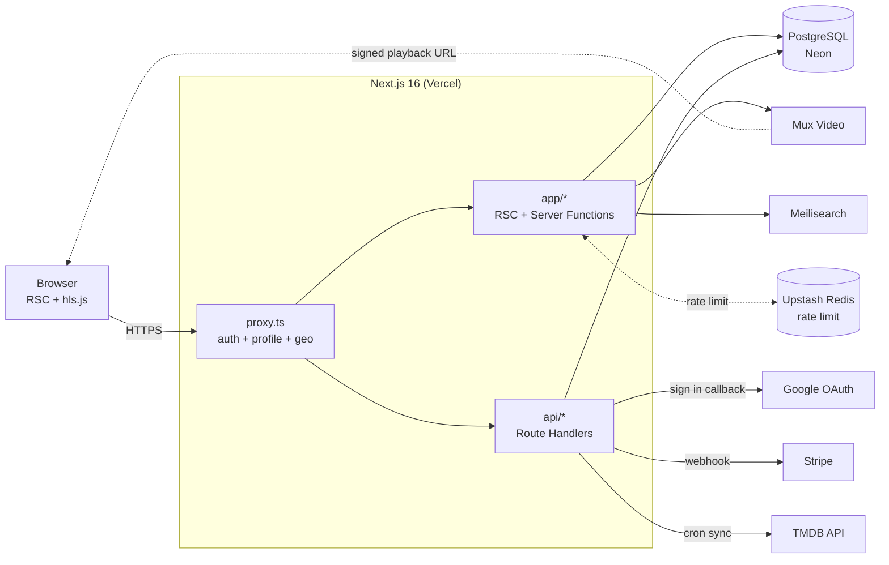
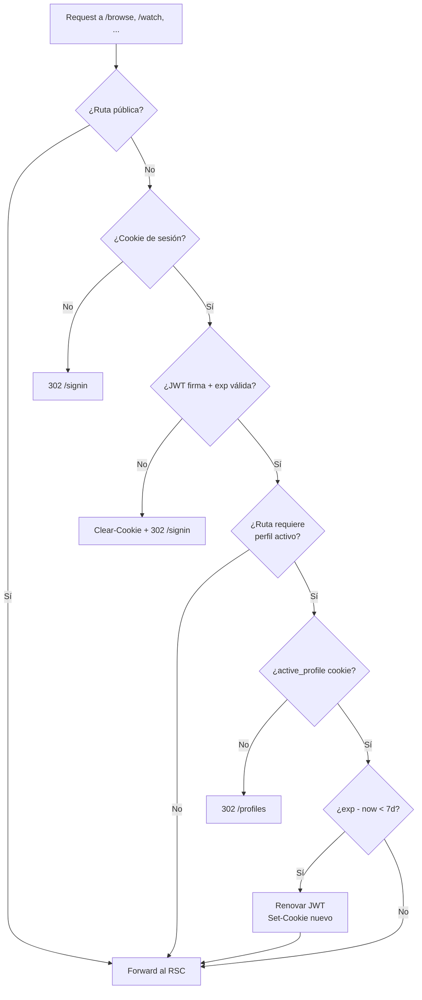
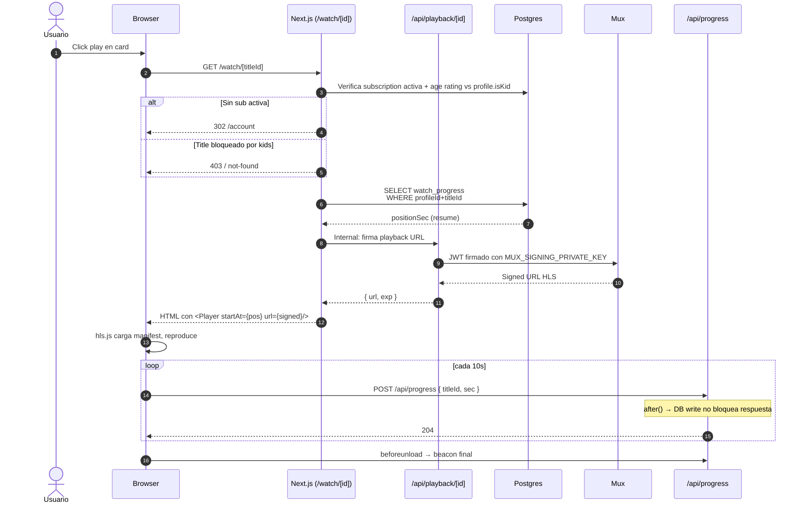
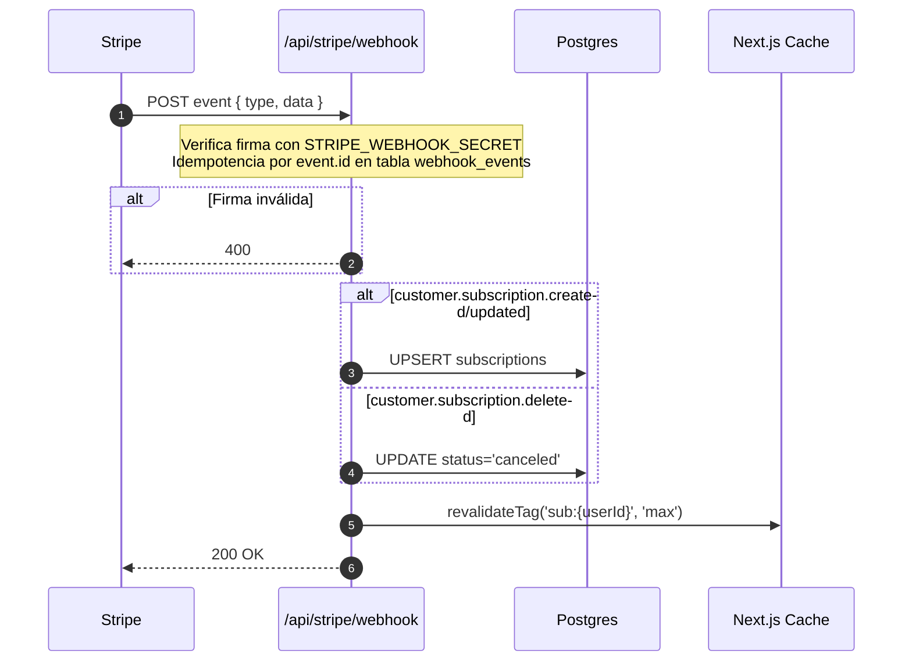

# Netflix Clone — Plan Maestro

> Documento único con **scope del producto, stack tecnológico, arquitectura, flujos principales (con diagramas Mermaid), aspectos de seguridad, estrategia de testing y secuencia de implementación**.
> Referencia técnica de Next.js 16 (App Router, Cache Components): [nextjs.md](nextjs.md).

---

## Tabla de Contenido

1. [Visión General](#1-visión-general)
2. [Key Features](#2-key-features)
3. [Stack Tecnológico y Servicios](#3-stack-tecnológico-y-servicios)
4. [Arquitectura](#4-arquitectura)
5. [Modelo de Datos](#5-modelo-de-datos)
6. [Mapa de Rutas (App Router)](#6-mapa-de-rutas-app-router)
7. [Flujos Principales](#7-flujos-principales) ← *con diagramas Mermaid*
8. [Aspectos Transversales](#8-aspectos-transversales)
9. [Inventario de Componentes](#9-inventario-de-componentes)
10. [Estrategia de Testing](#10-estrategia-de-testing) ← *unit, component, integration, E2E, security*
11. [Seguridad](#11-seguridad)
12. [Secuencia de Implementación](#12-secuencia-de-implementación)
13. [Riesgos y Preguntas Abiertas](#13-riesgos-y-preguntas-abiertas)

---

## 1. Visión General

Construir un clon funcional de Netflix con las features que definen el producto: autenticación, perfiles, navegación de catálogo, página de detalle, player de video, búsqueda, listas, recomendaciones y subscripciones.

**Principios rectores:**
- **Server-first**: la mayoría del trabajo ocurre en React Server Components; el cliente solo recibe los componentes interactivos.
- **Cache agresivo, invalidación precisa**: catálogo cacheado con `use cache` + `cacheTag`; mutaciones invalidan tags específicos.
- **Seguridad por defecto**: cookies `httpOnly` + `secure`, validación en el servidor, CSP estricta, OAuth con PKCE.
- **Testeable en todas las capas**: unit, component, integration y E2E.

**Alcance excluido (clone, no Netflix real):** DRM (Widevine/PlayReady/FairPlay), CDN multi-región propietario, recomendaciones ML production-grade, downloads offline, apps nativas.

---

## 2. Key Features

| # | Feature | Prioridad | Descripción |
|---|---------|-----------|-------------|
| 1 | **Autenticación con Google (OAuth 2.0 + PKCE)** | P0 | Sign in/up con un click. Sesión vía JWT en cookie `httpOnly`. |
| 2 | **Múltiples perfiles por cuenta** | P0 | Hasta 5 perfiles. Flag de kids. PIN opcional. |
| 3 | **Browse / Home** | P0 | Hero + filas (Trending, Continue Watching, New Releases, Genre rows). |
| 4 | **Página de detalle** | P0 | Sinopsis, cast, trailer, episodios (TV), "More Like This". |
| 5 | **Video Player** | P0 | HLS adaptativo, play/pause, seek, subtítulos, calidad, resume. |
| 6 | **Búsqueda** | P0 | Type-ahead por título, género, actor. |
| 7 | **My List** | P0 | Watchlist por perfil. |
| 8 | **Continue Watching** | P0 | Resume points por perfil/episodio. |
| 9 | **Páginas de género** | P1 | `/genre/[slug]`. |
| 10 | **Ratings** (👍/👎/❤️) | P1 | Alimenta recomendaciones. |
| 11 | **Subscripciones (Stripe)** | P1 | Basic / Standard / Premium. |
| 12 | **Ajustes de cuenta** | P1 | Idioma, dispositivos, billing. |
| 13 | **Kids mode + control parental** | P1 | PIN, filtro de age rating. |
| 14 | **Recomendaciones "Because you watched"** | P2 | Content-based primero, collaborative después. |
| 15 | **Trailer autoplay on hover** | P2 | Preview en hover de card. |
| 16 | **Notificaciones** | P2 | Nuevos episodios. |
| 17 | **Downloads offline** | Excluido | Fuera de scope web. |

---

## 3. Stack Tecnológico y Servicios

### 3.1 Capa de aplicación

| Concern | Elección | Razón |
|---|---|---|
| Framework | **Next.js 16** (App Router, Cache Components) | RSC + streaming + Server Functions ([nextjs.md §6](nextjs.md)). |
| Lenguaje | **TypeScript estricto** | Type safety server+client. |
| Styling | **Tailwind CSS + CSS variables** | Sin runtime cost. |
| UI primitives | **Radix UI + shadcn/ui** | Accesibles, headless, dark mode fácil. |
| Forms | **React Hook Form + Zod** | Schemas Zod reutilizados en Server Functions. |
| Estado cliente | **Zustand** (solo player + UI shell) | Resto del estado en RSC / URL. |
| Hosting | **Vercel** | Cache nativo + edge proxy. |

### 3.2 Datos e identidad

| Concern | Elección | Razón |
|---|---|---|
| Base de datos | **PostgreSQL (Neon)** | Serverless, branchable. |
| ORM | **Drizzle ORM** | Edge-friendly, SQL-first. |
| Auth | **Auth.js v5 (NextAuth)** con provider Google | Maneja PKCE/state/nonce automático. |
| Sesión | **JWT en cookie httpOnly** | Sin DB lookup por request. |
| Adapter | `@auth/drizzle-adapter` | Tablas `users`, `accounts`. |

### 3.3 Catálogo, video, búsqueda, pagos

| Concern | Elección |
|---|---|
| Metadata de títulos | **TMDB API** (sync nocturno a Postgres) |
| Hosting de video | **Mux** (HLS + signed URLs + thumbnails) |
| Player | `hls.js` + shell propio |
| Search | **Meilisearch Cloud** (fallback Postgres `tsvector`) |
| Pagos | **Stripe** (Checkout + Portal + Webhooks) |
| Imágenes | `next/image` + `image.tmdb.org` |

### 3.4 Infraestructura cross-cutting

| Concern | Elección |
|---|---|
| Cron | Vercel Cron → Route Handlers |
| Background jobs | `after()` de Next.js ([nextjs.md §16](nextjs.md)) |
| Rate limiting | Upstash Redis |
| Logs | Axiom |
| Analytics | PostHog |
| Error tracking | Sentry |
| Secrets | Vercel env vars |

### 3.5 Variables de entorno

```bash
# Core
AUTH_SECRET=                  # openssl rand -base64 32
AUTH_URL=https://app.com
DATABASE_URL=                 # Neon
# Google OAuth
GOOGLE_CLIENT_ID=
GOOGLE_CLIENT_SECRET=
# Mux
MUX_TOKEN_ID=
MUX_TOKEN_SECRET=
MUX_SIGNING_KEY_ID=
MUX_SIGNING_PRIVATE_KEY=
# Stripe
STRIPE_SECRET_KEY=
STRIPE_WEBHOOK_SECRET=
NEXT_PUBLIC_STRIPE_PUBLISHABLE_KEY=
# TMDB
TMDB_API_KEY=
TMDB_READ_TOKEN=
# Search
MEILISEARCH_HOST=
MEILISEARCH_API_KEY=
# Observability
SENTRY_DSN=
NEXT_PUBLIC_POSTHOG_KEY=
AXIOM_TOKEN=
# Rate limit
UPSTASH_REDIS_REST_URL=
UPSTASH_REDIS_REST_TOKEN=
```

---

## 4. Arquitectura



**Runtimes:**
- `proxy.ts` y rutas estáticas → **Edge runtime**.
- Rutas que tocan DB/Mux → **Node runtime** (driver Postgres).

---

## 5. Modelo de Datos

```ts
// db/schema/index.ts (Drizzle)

// --- Auth (estándar Auth.js) ---
users (
  id            uuid PK,
  email         text UNIQUE NOT NULL,
  emailVerified timestamptz,
  name          text,
  image         text,
  createdAt     timestamptz default now()
)

accounts (
  userId             uuid FK → users.id ON DELETE CASCADE,
  type               text,        -- 'oauth'
  provider           text,        -- 'google'
  providerAccountId  text,        -- sub del ID token
  id_token           text,
  access_token       text,
  refresh_token      text,
  expires_at         bigint,
  scope              text,
  PRIMARY KEY (provider, providerAccountId)
)
CREATE INDEX ON accounts(userId);

// --- Producto ---
profiles (
  id        uuid PK,
  userId    uuid FK → users.id ON DELETE CASCADE,
  name      text,
  avatar    text,
  isKid     boolean default false,
  pinHash   text             -- bcrypt, nullable
)
CREATE INDEX ON profiles(userId);

subscriptions (
  id                   uuid PK,
  userId               uuid FK → users.id,
  stripeCustomerId     text UNIQUE,
  stripeSubscriptionId text UNIQUE,
  plan                 text,    -- 'basic' | 'standard' | 'premium'
  status               text,    -- 'active' | 'past_due' | 'canceled' | ...
  currentPeriodEnd     timestamptz
)

// --- Catálogo ---
titles (
  id            uuid PK,
  tmdbId        bigint UNIQUE,
  type          text,           -- 'movie' | 'tv'
  title         text,
  slug          text UNIQUE,
  overview      text,
  posterPath    text,
  backdropPath  text,
  releaseDate   date,
  runtime       int,
  ageRating     text,           -- 'G' | 'PG' | 'PG-13' | 'R' | 'TV-MA' ...
  playbackId    text,           -- Mux
  searchTerms   tsvector
)
CREATE INDEX ON titles(slug);
CREATE INDEX ON titles USING gin(searchTerms);

genres        (id, name, slug)
title_genres  (titleId, genreId)  -- M:N
episodes      (id, titleId, season, number, name, overview, runtime, playbackId)

// --- Interacción por perfil ---
watchlist (
  profileId  uuid FK → profiles.id ON DELETE CASCADE,
  titleId    uuid FK → titles.id,
  addedAt    timestamptz default now(),
  PRIMARY KEY (profileId, titleId)
)

watch_progress (
  profileId    uuid FK → profiles.id,
  titleId      uuid FK → titles.id,
  episodeId    uuid NULL,
  positionSec  int,
  durationSec  int,
  updatedAt    timestamptz default now(),
  PRIMARY KEY (profileId, titleId, episodeId)
)
CREATE INDEX ON watch_progress(profileId, updatedAt DESC);

ratings (
  profileId  uuid,
  titleId    uuid,
  value      text,        -- 'up' | 'down' | 'love'
  createdAt  timestamptz default now(),
  PRIMARY KEY (profileId, titleId)
)
```

---

## 6. Mapa de Rutas (App Router)

```
app/
├── layout.tsx                       # html shell, fonts (S)
├── page.tsx                         # marketing landing (static)
├── (auth)/
│   ├── layout.tsx                   # logo-only chrome
│   ├── signin/page.tsx              # botón "Continuar con Google"
│   └── signup/page.tsx
├── (app)/                           # auth + perfil requeridos
│   ├── layout.tsx                   # TopNav + ProfileMenu
│   ├── profiles/
│   │   ├── page.tsx                 # "Who's watching?"
│   │   ├── manage/page.tsx
│   │   └── actions.ts               # 'use server'
│   ├── browse/
│   │   ├── page.tsx                 # home (use cache + cacheTag)
│   │   ├── tv/page.tsx
│   │   ├── movies/page.tsx
│   │   ├── new/page.tsx
│   │   └── my-list/page.tsx         # NO cacheado
│   ├── genre/[slug]/page.tsx        # generateStaticParams
│   ├── search/page.tsx
│   ├── title/[id]/page.tsx          # generateMetadata
│   ├── watch/[id]/page.tsx          # signed Mux URL + after()
│   └── account/
│       ├── page.tsx
│       └── devices/page.tsx
├── api/
│   ├── auth/[...nextauth]/route.ts  # Auth.js handlers
│   ├── stripe/webhook/route.ts
│   ├── sync/tmdb/route.ts           # cron
│   ├── search/route.ts
│   ├── progress/route.ts            # heartbeat del player
│   └── playback/[id]/route.ts       # signed playback URL
└── proxy.ts                         # guard global
```

### Estrategia de rendering

| Ruta | Estrategia | Cache | Primitiva Next.js |
|---|---|---|---|
| `/` | Estática | `force-cache` | `<Image priority>` |
| `/signin`, `/signup` | Dinámica | — | Auth.js |
| `/profiles` | Dinámica por user | — | `cookies()` |
| `/browse` | RSC streaming | `cacheTag('catalog')` + `cacheLife('hours')` | `use cache` + `<Suspense>` |
| `/browse/my-list` | Dinámica por profile | — | `cookies()` |
| `/genre/[slug]` | `generateStaticParams` top 30 | `cacheTag('catalog')` | [nextjs.md §13](nextjs.md) |
| `/title/[id]` | `generateStaticParams` top 500 | `cacheTag('title:{id}')` | `generateMetadata` |
| `/search` | Dinámica | — | `useSearchParams` |
| `/watch/[id]` | Dinámica | — | `after()` para logs |
| `/account` | Dinámica | `cacheTag('sub:{userId}')` | — |
| `/api/stripe/webhook` | Route Handler | — | `revalidateTag` |

---

## 7. Flujos Principales

### 7.1 Sign-in con Google (OAuth 2.0 + PKCE + OIDC)

```mermaid
sequenceDiagram
    autonumber
    actor U as Usuario
    participant B as Browser
    participant N as Next.js (Auth.js)
    participant G as Google OAuth
    participant DB as PostgreSQL

    U->>B: Click "Continuar con Google"
    B->>N: GET /api/auth/signin/google
    Note over N: Genera code_verifier, code_challenge=SHA256(verifier),<br/>state, nonce (32 bytes random cada uno)
    N-->>B: Set-Cookie __Host-authjs.pkce.code_verifier,<br/>__Host-authjs.state, __Host-authjs.nonce<br/>(httpOnly, secure, sameSite=lax, 10 min)
    N-->>B: 302 accounts.google.com/o/oauth2/v2/auth?<br/>response_type=code&scope=openid email profile&<br/>code_challenge=...&code_challenge_method=S256&<br/>state=...&nonce=...
    B->>G: GET authorize endpoint
    G-->>U: Consent screen (primera vez)
    U->>G: Approve
    G-->>B: 302 /api/auth/callback/google?code=...&state=...
    B->>N: GET callback
    Note over N: 1. Valida state == cookie<br/>2. Lee code_verifier de cookie
    N->>G: POST /token (code + code_verifier + secret)
    G-->>N: { id_token, access_token }
    Note over N: 3. Verifica firma id_token vs JWK Google<br/>4. Valida iss, aud, exp, nonce<br/>5. Valida email_verified === true
    N->>DB: Upsert user + account
    alt Usuario nuevo
        N->>DB: INSERT users + INSERT profiles (default)
    else Email existe con otro provider
        N-->>B: 302 /signin?error=OAuthAccountNotLinked
    end
    Note over N: Genera JWT sesión (HS256, AUTH_SECRET, 30d)
    N-->>B: Clear cookies temp; Set-Cookie __Secure-authjs.session-token<br/>302 /profiles
```

### 7.2 Validación de Sesión en cada Request (proxy.ts)



### 7.3 Selección de Perfil

```mermaid
sequenceDiagram
    autonumber
    actor U as Usuario
    participant B as Browser
    participant N as Next.js
    participant DB as Postgres

    U->>B: Llega a /profiles ya autenticado
    B->>N: GET /profiles
    N->>DB: SELECT profiles WHERE userId = jwt.sub
    DB-->>N: [perfil1, perfil2, ...]
    N-->>B: HTML grid de perfiles
    U->>B: Click "Diego"
    B->>N: Server Function selectProfile(id)
    Note over N: Verifica que profileId pertenece a jwt.sub
    alt Perfil con PIN
        N-->>B: Render PinDialog
        U->>B: Ingresa PIN
        B->>N: selectProfile(id, pin)
        N->>DB: bcrypt.compare(pin, profile.pinHash)
        alt PIN incorrecto
            N->>N: Rate limit check<br/>(5 fallos / 15 min)
            N-->>B: 401 + mensaje
        end
    end
    N-->>B: Set-Cookie active_profile=id; 302 /browse
```

### 7.4 Reproducción de Video



### 7.5 Webhook de Stripe (alta/baja de subscripción)



### 7.6 Sign Out

```mermaid
sequenceDiagram
    autonumber
    actor U as Usuario
    participant B as Browser
    participant N as Next.js
    participant G as Google (opcional)

    U->>B: Click "Cerrar sesión"
    B->>N: POST /api/auth/signout
    opt Revocación remota
        N->>G: POST /revoke?token=access_token
    end
    N-->>B: Set-Cookie session-token=; Max-Age=0<br/>active_profile=; Max-Age=0<br/>302 /signin
```

---

## 8. Aspectos Transversales

### 8.1 Caching (Cache Components)

| Capa | Mecanismo | Invalidación |
|---|---|---|
| Filas de catálogo | `use cache` + `cacheTag('catalog')` + `cacheLife('hours')` | Cron TMDB → `revalidateTag('catalog', 'max')` |
| Detalle de título | `cacheTag('title:{id}')` | Admin → `revalidateTag('title:{id}')` |
| My List | **NO cacheado** | — |
| Continue Watching | **NO cacheado** | — |
| Subscripción | `cacheTag('sub:{userId}')` | Stripe webhook |
| Búsqueda | **NO cacheado server-side** (Meilisearch < 50ms) | — |

### 8.2 Server Functions (mutaciones)

```ts
// app/(app)/profiles/actions.ts (ejemplo)
'use server'
import { z } from 'zod'
import { auth } from '@/auth'
import { cookies } from 'next/headers'
import { redirect } from 'next/navigation'

const SelectSchema = z.object({ profileId: z.string().uuid(), pin: z.string().optional() })

export async function selectProfile(input: z.infer<typeof SelectSchema>) {
  const session = await auth()
  if (!session?.user) redirect('/signin')

  const data = SelectSchema.parse(input)
  const profile = await db.query.profiles.findFirst({
    where: and(eq(profiles.id, data.profileId), eq(profiles.userId, session.user.id))
  })
  if (!profile) throw new Error('Profile not found')
  if (profile.pinHash && !(await bcrypt.compare(data.pin ?? '', profile.pinHash))) {
    throw new Error('Invalid PIN')
  }

  (await cookies()).set('active_profile', profile.id, {
    httpOnly: true, secure: true, sameSite: 'lax', path: '/', maxAge: 60 * 60 * 24 * 30,
  })
  redirect('/browse')
}
```

Otras Server Functions: `addToList`, `removeFromList`, `rate`, `createProfile`, `updateProfile`, `setPin`.

### 8.3 proxy.ts (guard único)

```ts
import { auth } from '@/auth'
import { NextResponse } from 'next/server'

const PUBLIC = ['/', '/signin', '/signup', '/api/auth', '/api/stripe/webhook']

export default auth((req) => {
  const { pathname } = req.nextUrl
  if (PUBLIC.some(p => pathname === p || pathname.startsWith(p + '/'))) return
  if (!req.auth) return NextResponse.redirect(new URL('/signin', req.url))

  const needsProfile = /^\/(browse|watch|title|account)/.test(pathname)
  const profile = req.cookies.get('active_profile')?.value
  if (needsProfile && !profile && pathname !== '/profiles') {
    return NextResponse.redirect(new URL('/profiles', req.url))
  }
})

export const config = {
  matcher: ['/((?!_next/static|_next/image|favicon.ico|.*\\.(?:png|jpg|svg)$).*)'],
}
```

### 8.4 Imágenes

```js
// next.config.js
images: {
  remotePatterns: [
    { protocol: 'https', hostname: 'image.tmdb.org' },
    { protocol: 'https', hostname: 'image.mux.com' },
    { protocol: 'https', hostname: 'lh3.googleusercontent.com' }, // avatar Google
  ],
  formats: ['image/avif', 'image/webp'],
}
```

Hero: `priority`. Cards: lazy + `sizes="(max-width: 768px) 50vw, 20vw"`.

### 8.5 SEO

`generateMetadata` en `/title/[id]` con `openGraph` (poster), Twitter card y `alternates.canonical`. Rutas autenticadas: `robots: { index: false }`.

---

## 9. Inventario de Componentes

**Anotación:** (S) Server Component / (C) Client Component.

### 9.1 Foundation
- `Logo` (S), `Avatar` (S), `Skeleton` (S)
- shadcn/ui: `Button`, `Input`, `Select`, `Dialog`, `Tooltip`, `Toast` (C donde interactivo)

### 9.2 Layout
- `TopNav` (C) — hides on scroll, transparent sobre hero
- `ProfileMenu` (C) — switch profile, account, sign out
- `MobileNav` (C)
- `Footer` (S)

### 9.3 Browse
- `Hero` (S) — featured + Play/More Info
- `Row` (S, async streaming)
- `RowSkeleton` (S)
- `Card` (C, lazy) — hover trailer preview
- `CardModal` (C)

### 9.4 Title detail
- `TitleHero` (S)
- `EpisodeList` (S) + `EpisodeRow` (C)
- `MoreLikeThis` (S)
- `RatingControls` (C, optimistic)

### 9.5 Player
- `PlayerShell` (C, hls.js)
- `ControlBar` (C), `SeekBar` (C), `SubtitlesMenu` (C)
- `NextUp` (C)

### 9.6 Search
- `SearchBar` (C, `useSearchParams`)
- `SearchResultsGrid` (S, streamed)

### 9.7 Auth & profiles
- `GoogleSignInButton` (C)
- `ProfilePicker` (S), `ProfileForm` (C), `PinDialog` (C)

### 9.8 Account
- `PlanCard` (S), `BillingPortalButton` (C), `DeviceList` (S)

### 9.9 System
- `app/error.tsx` (C), `app/not-found.tsx` (S), `app/loading.tsx` (S) por segmento

---

## 10. Estrategia de Testing

### 10.1 Pirámide de testing

```
                 /\
                /E2\         ~10–20  Playwright  (flujos críticos)
               /----\
              /Integ.\       ~50–100 Vitest + DB test container
             /--------\
            /Component \    ~150–300 Vitest + RTL
           /------------\
          /     Unit     \  ~500+    Vitest (puro)
         /----------------\
```

**Regla:** un bug nuevo se cubre con un test del nivel más bajo posible que pueda detectarlo en el futuro.

### 10.2 Tooling

| Capa | Herramienta | Para qué |
|---|---|---|
| Unit | **Vitest** | Funciones puras, utils, schemas Zod, helpers de auth. |
| Component | **Vitest + React Testing Library + jest-dom** | Componentes UI en aislamiento. |
| RSC | **Vitest** con `@testing-library/react` server harness | Render de Server Components con mocks de `cookies()`/`headers()`. |
| Integration | **Vitest + Testcontainers (Postgres)** | Server Functions y Route Handlers contra una DB real efímera. |
| E2E | **Playwright** | Flujos completos en browser (Chromium, Firefox, WebKit). |
| Visual regression | **Playwright `toHaveScreenshot`** | Capturas de cards, hero, player. |
| Accessibility | **`@axe-core/playwright`** | Auditoría a11y en cada test E2E. |
| Mocking HTTP | **MSW (Mock Service Worker)** | Mocks de TMDB, Mux, Stripe en unit/component/integration. |
| Load testing | **k6** | API de progress + signed URLs. |
| Security | **OWASP ZAP**, `npm audit`, **Snyk** | Pipeline de seguridad en CI. |
| Performance | **Lighthouse CI** | LCP < 2.5s en `/browse`, CLS < 0.1. |
| Coverage | **Vitest c8 / istanbul** | Gate: ≥ 80% líneas en `lib/`. |

### 10.3 Unit tests (Vitest)

**Objetivo:** lógica pura sin dependencias externas. Rápido (< 1ms por test).

```ts
// lib/auth/__tests__/jwt.test.ts
import { describe, it, expect } from 'vitest'
import { decodeSessionJWT } from '../jwt'

describe('decodeSessionJWT', () => {
  it('returns null for missing token', () => {
    expect(decodeSessionJWT(undefined)).toBeNull()
  })
  it('returns null for expired token', () => {
    const token = signJWT({ sub: 'u1', exp: 1 })
    expect(decodeSessionJWT(token)).toBeNull()
  })
  it('returns claims for valid token', () => {
    const token = signJWT({ sub: 'u1', exp: Math.floor(Date.now()/1000) + 60 })
    expect(decodeSessionJWT(token)?.sub).toBe('u1')
  })
})
```

**Cobertura prioritaria:**
- `lib/auth/*` — decode JWT, helpers de cookies, validación de roles.
- `lib/zod/*` — todos los schemas (boundary cases, valores inválidos).
- `lib/mux/sign.ts` — firma de URLs.
- `lib/cache/*` — claves y tags.
- `lib/recommendations/*` — scoring functions.

### 10.4 Component tests (Vitest + RTL)

**Objetivo:** componentes Client en aislamiento. Props in → DOM/eventos out.

```tsx
// components/__tests__/RatingControls.test.tsx
import { render, screen } from '@testing-library/react'
import userEvent from '@testing-library/user-event'
import { RatingControls } from '../RatingControls'

describe('<RatingControls>', () => {
  it('shows the current rating', () => {
    render(<RatingControls titleId="t1" initialValue="up" onRate={vi.fn()} />)
    expect(screen.getByRole('button', { name: /thumbs up/i })).toHaveAttribute('aria-pressed', 'true')
  })
  it('calls onRate with new value on click', async () => {
    const onRate = vi.fn()
    render(<RatingControls titleId="t1" initialValue={null} onRate={onRate} />)
    await userEvent.click(screen.getByRole('button', { name: /love/i }))
    expect(onRate).toHaveBeenCalledWith('t1', 'love')
  })
  it('is keyboard accessible', async () => {
    render(<RatingControls titleId="t1" initialValue={null} onRate={vi.fn()} />)
    await userEvent.tab()
    expect(screen.getByRole('button', { name: /thumbs up/i })).toHaveFocus()
  })
})
```

**Cobertura prioritaria:**
- `Card` — hover preview se dispara con debounce, no en touch devices.
- `SearchBar` — debounce 200ms, URL se actualiza vía `router.replace`.
- `PlayerShell` — controles aparecen en hover/focus, ocultos por defecto, atajos de teclado (space=play, ← →=seek).
- `ProfilePicker` — selección, PIN dialog cuando aplica.
- `PinDialog` — bloqueo después de 5 intentos.
- `CardModal` — focus trap, ESC cierra.

### 10.5 Server Component tests

RSC se testean ejecutando el componente directamente y aserciendo sobre el `ReactNode`/HTML generado.

```tsx
// app/(app)/browse/__tests__/page.test.tsx
import { renderToString } from 'react-dom/server'
import BrowsePage from '../page'
import { vi } from 'vitest'

vi.mock('next/headers', () => ({
  cookies: async () => ({ get: (k: string) => k === 'active_profile' ? { value: 'p1' } : null }),
}))
vi.mock('@/lib/db', () => ({ db: { /* stub queries */ } }))

it('renders Trending row with first 10 titles', async () => {
  const html = renderToString(await BrowsePage())
  expect(html).toMatch(/Trending Now/)
  expect(html.match(/data-title-card/g)?.length).toBeGreaterThanOrEqual(10)
})
```

### 10.6 Integration tests (Server Functions + Route Handlers)

**Objetivo:** validar la frontera servidor↔DB. Usa Postgres real vía Testcontainers, sin mocks de DB.

```ts
// app/(app)/profiles/__tests__/actions.integration.test.ts
import { describe, it, beforeAll, afterAll, expect } from 'vitest'
import { startPostgres } from '@/test/containers'
import { selectProfile } from '../actions'

let stop: () => Promise<void>
beforeAll(async () => { stop = await startPostgres() })
afterAll(async () => { await stop() })

describe('selectProfile', () => {
  it('sets active_profile cookie when profile belongs to user', async () => {
    const user = await createUserFixture()
    const profile = await createProfileFixture(user.id)
    await withSession(user, async () => {
      await selectProfile({ profileId: profile.id })
      expect(getCookie('active_profile')).toBe(profile.id)
    })
  })
  it('throws when profile belongs to another user', async () => {
    const userA = await createUserFixture()
    const userB = await createUserFixture()
    const profileB = await createProfileFixture(userB.id)
    await withSession(userA, async () => {
      await expect(selectProfile({ profileId: profileB.id })).rejects.toThrow(/not found/i)
    })
  })
  it('requires PIN when profile.pinHash is set', async () => {
    const user = await createUserFixture()
    const profile = await createProfileFixture(user.id, { pin: '1234' })
    await withSession(user, async () => {
      await expect(selectProfile({ profileId: profile.id })).rejects.toThrow(/PIN/)
      await selectProfile({ profileId: profile.id, pin: '1234' }) // ok
    })
  })
})
```

**Cobertura prioritaria:**
- `/api/stripe/webhook` — firma válida/inválida, idempotencia, cada tipo de evento.
- `/api/playback/[id]` — sin sub → 403; kids + R-rated → 403; con sub válida → URL firmada.
- `/api/progress` — escribe `watch_progress`; nunca bloquea respuesta (verificar tiempo < 50ms).
- `/api/sync/tmdb` — autenticación con cron secret, upsert correcto, idempotente.
- Auth.js callback — `email_verified=false` → rechazado.

### 10.7 E2E tests (Playwright)

**Objetivo:** validar flujos completos de usuario. Tests críticos solamente.

```ts
// e2e/auth.spec.ts
import { test, expect } from '@playwright/test'

test.describe('Authentication', () => {
  test('Google sign-in → profile select → browse', async ({ page, context }) => {
    await mockGoogleOAuth(context, { email: 'demo@ex.com', sub: 'g_123', email_verified: true })
    await page.goto('/signin')
    await page.getByRole('button', { name: /continuar con google/i }).click()
    await expect(page).toHaveURL(/\/profiles/)
    await page.getByRole('button', { name: /demo/i }).click()
    await expect(page).toHaveURL(/\/browse/)
    await expect(page.getByRole('heading', { name: /trending now/i })).toBeVisible()
  })

  test('rejects unverified email', async ({ page, context }) => {
    await mockGoogleOAuth(context, { email: 'spoof@ex.com', email_verified: false })
    await page.goto('/signin')
    await page.getByRole('button', { name: /continuar con google/i }).click()
    await expect(page).toHaveURL(/error=EmailNotVerified/)
  })

  test('rejects invalid OAuth state (CSRF)', async ({ request }) => {
    const res = await request.get('/api/auth/callback/google?code=abc&state=invalid')
    expect(res.status()).toBe(400)
  })
})
```

**Flujos a cubrir E2E:**
1. **Auth:** Google sign-in happy path, email no verificado, state inválido, account linking.
2. **Profile:** seleccionar perfil, crear perfil, PIN correcto/incorrecto, 5 intentos → lock.
3. **Browse:** navegar a `/browse`, scroll de fila, click en card, modal con info.
4. **Player:** play título, seek, resume desde otra sesión.
5. **My List:** agregar/quitar, refrescar, persiste.
6. **Search:** type-ahead, navegar a resultado.
7. **Subscription:** sin sub → bloqueo en `/watch/[id]`, checkout (Stripe test mode), unlock.
8. **Parental:** kids profile no ve R-rated.
9. **Sign out:** limpia cookies, redirige.

### 10.8 Visual regression

Snapshots de Playwright en componentes visualmente estables (Hero, Card, Player chrome). Tolerancia 0.1%.

```ts
test('Hero matches snapshot', async ({ page }) => {
  await page.goto('/browse')
  await page.waitForSelector('[data-hero]')
  await expect(page.locator('[data-hero]')).toHaveScreenshot('hero.png', { maxDiffPixelRatio: 0.001 })
})
```

### 10.9 Accessibility

`@axe-core/playwright` en cada test E2E crítico. Falla la build si hay violaciones `serious` o `critical`.

```ts
import AxeBuilder from '@axe-core/playwright'

test('browse page is accessible', async ({ page }) => {
  await page.goto('/browse')
  const results = await new AxeBuilder({ page }).analyze()
  expect(results.violations.filter(v => ['serious','critical'].includes(v.impact!))).toEqual([])
})
```

Checklist manual de accesibilidad:
- Player completo navegable por teclado (Tab, Space, ←→↑↓, F, M).
- Filas con scroll horizontal por teclado.
- Modal con focus trap + ESC.
- Contraste ≥ 4.5:1 en texto, 3:1 en UI.
- `prefers-reduced-motion` desactiva autoplay trailers.

### 10.10 Performance

- **Lighthouse CI** en pipeline: budget LCP < 2.5s, TBT < 200ms, CLS < 0.1, score Performance ≥ 90.
- **Web Vitals reales** vía PostHog (`web-vitals` npm).
- **Load tests con k6:**
  - `/api/progress` — 1000 req/s sostenido, p99 < 100ms.
  - `/api/playback/[id]` — 200 req/s, p99 < 200ms.

### 10.11 Security tests

| Test | Herramienta | Cuándo |
|---|---|---|
| Dependencias vulnerables | `npm audit` + Snyk | CI por PR |
| Static analysis (SAST) | `eslint-plugin-security`, `semgrep` | CI por PR |
| Secrets en código | `gitleaks` | pre-commit hook |
| OWASP ZAP baseline | ZAP CLI | Nightly contra preview |
| Headers de seguridad | `securityheaders.com` API en CI | PR |
| Cookies con flags correctos | Test E2E custom | PR |
| JWT tampering | E2E custom (modificar cookie, esperar 401) | PR |
| CSRF en callback OAuth | E2E (state inválido) | PR |
| Replay del code OAuth | Integration test | PR |
| Rate limit de PIN | E2E (6 intentos → lock) | PR |

### 10.12 CI Pipeline (GitHub Actions)

```yaml
# .github/workflows/ci.yml (esquemático)
jobs:
  lint:        # eslint + tsc --noEmit + gitleaks
  unit:        # vitest run --coverage (gate 80%)
  component:   # vitest run components/
  integration: # vitest run --pool=forks (Testcontainers postgres)
  e2e:         # playwright test (3 browsers, paralelo)
  visual:      # playwright snapshots
  a11y:        # axe en E2E
  security:    # npm audit + snyk + zap baseline
  lighthouse:  # lhci collect en preview deploy
  bundle-size: # next-bundle-analyzer + size-limit gate
```

**Gates obligatorios para merge:**
- Cobertura unit ≥ 80% en `lib/`.
- 0 errores de tipos, 0 errores eslint.
- 0 violaciones a11y `serious`/`critical`.
- Lighthouse Performance ≥ 90 en `/browse`.
- Bundle JS inicial ≤ 200KB gzip.
- 0 vulnerabilidades `high`/`critical`.

### 10.13 Test data strategy

- **Fixtures factory** (`@/test/factories.ts`) para `user`, `profile`, `title`, `episode`, `subscription`.
- **Seeds determinísticas** en Postgres test container: 50 títulos con tipos variados, 3 usuarios, 5 perfiles.
- **MSW handlers** para TMDB y Mux con respuestas reales sanitizadas.
- **Stripe test mode** para integration + E2E.
- **Mock OAuth provider** (`mock-oauth2-server`) en E2E para no depender de Google.

### 10.14 Estructura de archivos de test

```
src/
  lib/
    auth/
      jwt.ts
      jwt.test.ts                 ← unit, co-ubicado
  components/
    RatingControls.tsx
    RatingControls.test.tsx       ← component, co-ubicado
  app/(app)/profiles/
    actions.ts
    actions.test.ts               ← integration, co-ubicado
test/
  factories.ts
  containers.ts                   ← Testcontainers setup
  msw/
    handlers.ts
e2e/
  auth.spec.ts
  browse.spec.ts
  player.spec.ts
  subscription.spec.ts
  fixtures/
    mock-oauth.ts
```

---

## 11. Seguridad

### 11.1 Amenazas y mitigaciones

| # | Amenaza | Mitigación |
|---|---------|------------|
| 1 | CSRF en callback OAuth | `state` aleatorio en cookie `__Host-`. |
| 2 | Authorization code interception | **PKCE S256** obligatorio. |
| 3 | Replay del ID token | `nonce` aleatorio validado vs JWT. |
| 4 | ID token falsificado | Verificar firma JWS vs JWK Google + `iss`/`aud`/`exp`. |
| 5 | Email no verificado | Rechazar si `email_verified !== true`. |
| 6 | Account takeover vía linking | `allowDangerousEmailAccountLinking: false`. |
| 7 | Open redirect en `callbackUrl` | Auth.js valida mismo origen. |
| 8 | XSS robando JWT | Cookie `httpOnly` + CSP estricta. |
| 9 | Cookie sin TLS | `secure: true` + prefijo `__Secure-`/`__Host-`. |
| 10 | CSRF en Server Functions | `sameSite=lax` + token CSRF de Auth.js. |
| 11 | Session fixation | Nuevo JWT después de cada login. |
| 12 | Brute force PIN | Rate limit 5 intentos / 15 min por (IP, profileId). |
| 13 | Clickjacking | `X-Frame-Options: DENY` + CSP `frame-ancestors 'none'`. |
| 14 | Stripe webhook spoof | Verificar firma con `STRIPE_WEBHOOK_SECRET`. |
| 15 | Mux signed URL leak | TTL 4h + `playback_restriction` por IP/UA. |
| 16 | Logs con tokens | Redactar `Authorization`, `Cookie`, `id_token`, `access_token`. |
| 17 | SQL injection | Drizzle parameterized queries (sin string concat). |
| 18 | Dependencias vulnerables | Snyk + `npm audit` en CI. |
| 19 | Bypass del proxy.ts | `matcher` cubre todo excepto assets; auth re-validada en cada Server Function. |
| 20 | Edad de contenido (kids) | Gate server-side en `/watch/[id]` además del UI. |

### 11.2 Cookies — configuración

| Cookie | Prefijo | httpOnly | secure | sameSite | maxAge |
|---|---|---|---|---|---|
| Sesión | `__Secure-authjs.session-token` | ✅ | ✅ | lax | 30d |
| PKCE verifier | `__Host-authjs.pkce.code_verifier` | ✅ | ✅ | lax | 10 min |
| OAuth state | `__Host-authjs.state` | ✅ | ✅ | lax | 10 min |
| OAuth nonce | `__Host-authjs.nonce` | ✅ | ✅ | lax | 10 min |
| CSRF token | `__Host-authjs.csrf-token` | ✅ | ✅ | lax | sesión |
| Active profile | `active_profile` | ✅ | ✅ | lax | 30d |

### 11.3 Headers de seguridad (`next.config.js`)

```js
async headers() {
  return [{
    source: '/(.*)',
    headers: [
      { key: 'Strict-Transport-Security', value: 'max-age=63072000; includeSubDomains; preload' },
      { key: 'X-Frame-Options', value: 'DENY' },
      { key: 'X-Content-Type-Options', value: 'nosniff' },
      { key: 'Referrer-Policy', value: 'strict-origin-when-cross-origin' },
      { key: 'Permissions-Policy', value: 'camera=(), microphone=(), geolocation=()' },
      { key: 'Content-Security-Policy', value: [
        "default-src 'self'",
        "img-src 'self' https://image.tmdb.org https://lh3.googleusercontent.com data:",
        "media-src https://stream.mux.com",
        "script-src 'self' 'nonce-{NONCE}'",
        "style-src 'self' 'unsafe-inline'",
        "connect-src 'self' https://accounts.google.com https://oauth2.googleapis.com https://api.mux.com",
        "frame-ancestors 'none'",
        "form-action 'self' https://accounts.google.com",
      ].join('; ') },
    ],
  }]
}
```

### 11.4 Rate limiting (Upstash Redis)

| Endpoint | Límite |
|---|---|
| `/api/auth/signin/google` | 10 req/min por IP |
| `/api/auth/callback/google` | 20 req/min por IP |
| PIN de perfil | 5 intentos / 15 min por (IP, profileId) |
| `/api/progress` | 12 req/min por sesión (heartbeat cada 10s + margen) |
| `/api/search` | 60 req/min por sesión |

---

## 12. Secuencia de Implementación

Cada fase es shippable y termina con una demo verificable.

| Fase | Días | Entregable |
|---|---|---|
| **0. Foundation** | 1 | `create-next-app`, Drizzle + Neon, shadcn, eslint+husky, security headers. |
| **1. Auth + Profiles** | 2–4 | Google OAuth, `proxy.ts`, `/profiles` picker, PIN. |
| **2. Catalog ingestion** | 5–6 | `/api/sync/tmdb`, Vercel Cron, Meilisearch sync. |
| **3. Browse** | 7–9 | Hero + Rows con streaming, `use cache` + `cacheTag`, Card hover. |
| **4. Title detail + My List** | 10–11 | `/title/[id]`, `generateMetadata`, watchlist, ratings. |
| **5. Player** | 12–15 | Mux signed URLs, hls.js shell, `/api/progress`, Continue Watching. |
| **6. Search** | 16–17 | SearchBar + Meilisearch results. |
| **7. Subscriptions** | 18–20 | Stripe Checkout, Portal, Webhook + gate `/watch`. |
| **8. Parental controls** | 21–22 | PIN, age rating filter, Kids UI variant. |
| **9. Observability + polish** | 23–25 | Sentry, PostHog, Axiom, a11y, Lighthouse. |
| **10. Testing hardening** | 26–28 | Cobertura unit 80%, E2E críticos, security pipeline. |
| **11. Stretch** | post-MVP | Recomendaciones (pgvector), notifications, i18n. |

---

## 13. Riesgos y Preguntas Abiertas

### 13.1 Riesgos

| Riesgo | Mitigación |
|---|---|
| Contenido licenciado — no podemos stream Netflix originals | Mux sample assets + dominio público + clips propios. Aclarar en README. |
| TMDB rate limit (50 req/s/IP) | Sync nightly, nunca llamar TMDB en request path. |
| Cache Components en canary de v16 | Pin de versión + fallback a `fetch({ next: { revalidate } })`. |
| Stripe webhook delivery | Retries de Stripe + idempotencia por `event.id`. |
| QoE del player en redes lentas | Mux Data alerta rebuffer > 2%, bitrate inicial bajo. |
| JWT no se revoca instantáneamente | TTL 30d + rotación de `AUTH_SECRET` ante incidente. Considerar `revoked_sessions` si crítico. |

### 13.2 Preguntas abiertas

1. **¿Solo Google, o también email/password?** Plan actual cubre solo Google. Email/password agrega ~1 día (signup, reset, verify).
2. **¿JWT-only sessions o también DB sessions?** JWT por defecto. Pasamos a DB sessions si se requiere revocación inmediata.
3. **¿Stripe live o test mode?** Determina si es producción o portfolio demo.
4. **¿Dominio de producción?** Requerido para registrar redirect URI en Google.
5. **¿Compliance (GDPR/CCPA)?** Si sí: consentimiento explícito, export de datos, derecho al olvido.
6. **¿Mobile-web only o React Native después?** Influencia el diseño de la API de `/api/playback` y `/api/progress` ahora.
7. **¿Coverage gate más alto que 80%?** Algunos equipos usan 90% en `lib/`.

---

**Confirma estos puntos y arrancamos en la Fase 0.**

> **Nota:** Este documento reemplaza a `AUTH_PLAN.md` (contenido integrado en §7.1 y §11). Se puede eliminar.
